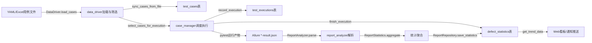

# TestMatrix core层架构设计文档

> 本文档详细说明 core 层（平台核心逻辑层）的架构设计、模块职责、关键设计决策与扩展点，
> 适合作为架构讲解与技术评审材料。

## 1. 架构总览

core 层是平台的业务核心，负责测试用例的**数据驱动、调度执行、报告分析**三大核心能力，
由三个模块构成自洽的三层流水线：

- **数据驱动层**（`data_driver`）：统一加载 YAML/Excel 用例数据，内存三维筛选
- **调度执行层**（`case_manager`）：用例入库、批次管理、分级执行、结果记录与汇总
- **报告分析层**（`report_analyzer`）：Allure 结果解析 → 统计聚合 → 持久化入库 → 趋势查询

### 1.1 完整数据流



文字版：用例文件 → data_driver 加载筛选 → case_manager 入库并调度执行 → 执行明细与批次汇总落库 → pytest 产出 Allure JSON → report_analyzer 解析统计入库 → Web 看板与通知消费。

### 1.2 与其他层的关系

| 层 | 提供能力 | core层的消费方式 |
| --- | --- | --- |
| common 层 | LogManager 日志、env_manager 配置、HttpClient/Serial/Telnet 协议客户端、Assertion 断言库 | 全模块统一 `LogManager.get_logger()`；配置经 env_manager 注入 |
| db 层 | 3 张核心表 ORM 模型 + DatabaseSession 会话管理（SQLite/MySQL 双模式） | case_manager 顶部直接导入；report_analyzer 函数内延迟导入（规避循环依赖） |

## 2. 模块详细设计

### 2.1 data_driver 数据驱动引擎

**职责**：屏蔽 YAML/Excel 格式差异，对外提供统一的用例加载（`load_cases`）与三维筛选（`filter_cases`）能力，输出可直接用于 `pytest.mark.parametrize` 的列表结构。

**核心入口**：

```python
cases = DataDriver.load_cases("testdata/yaml/api_user_query_matrix.yaml")
smoke_cases = DataDriver.filter_cases(cases, priority="P0", tags=["smoke"])
```

**设计决策**：

1. **为什么支持 YAML 和 Excel 双格式？** 团队角色分工不同——测开习惯 YAML（版本友好、可 code review），业务测试习惯 Excel（零门槛填写）。统一入口按后缀自动分发，调用方零感知。
2. **为什么三维筛选用内存实现而不是 SQL 查询？** 数据加载层与持久层解耦：筛选发生在数据入库之前（参数化直用场景），内存筛选不依赖数据库连接，同时保证同一套筛选语义（module 精确 / priority 忽略大小写 / tags 交集）在文件与数据库两种数据源上行为一致。
3. **大数据量如何处理内存？** 当前 50 条量级实测单条加载+校验+规范化仅 0.55ms（吞吐约 1800 条/秒），瓶颈在 HTTP 执行而非数据层；已预留分片加载扩展位（Day110 计划），万级用例再引入生成器逐批消费，避免过度设计。

**异常处理**：文件不存在/后缀不支持抛 `DataDriverError`；YAML 语法错误、字段校验失败（必填缺失/优先级非法/tags 类型错误）的报错均携带**行号或用例序号 + 字段名**中文定位信息；Excel 空行自动跳过、空表头直接报错。

### 2.2 case_manager 用例调度引擎

**职责**：用例加载入库（upsert）、批次创建与管理、分级执行调度、单条结果记录、批次汇总统计、CLI 命令行入口（`python -m src.core.case_manager` 可独立演示完整链路）。

**设计决策**：

1. **批次号为什么用"时间戳+uuid4前4位"而不是数据库自增 ID？** 三点考虑：① 可读性——`RUN-20260824-213000-a1b2` 一眼可辨执行日期，排查问题无需查库；② 唯一性不依赖数据库——CLI/CI/未来分布式执行节点本地即可生成，不引入发号中心；③ 进程内集合防碰撞重试（同秒 100 次理论碰撞率约 7% 降为 0），保证批量场景确定性。
2. **分级执行如何设计？** 以优先级为主轴（P0 冒烟 → P1 核心 → P2 常规 → P3 边缘），`select_cases_for_execution` 复用 `list_cases` 的"priority 升序 + case_id 升序"排序，执行顺序天然与风险等级对齐；tags 维度（从 description 解析"标签:"格式）支持 smoke/regression 圈定回归范围，与模块/优先级 AND 组合。
3. **dry-run 模式为什么重要？** 执行计划的可验证性——上线新筛选条件前先 `--dry-run` 打印待执行列表（P0 级用例 3 条，含模块与名称），确认圈定范围无误再真正执行；同时保证零副作用（不写 test_executions/defect_statistics），CI 中可作为冒烟前置检查。
4. **CLI 为什么用 argparse 而不是 click？** 标准库零依赖（项目工程化约束）、`action="append"` 原生支持 `-p P0 -p P1` 多值传入，内部工具链无需引入第三方依赖的额外供应链成本。

**异常处理**：批次号/用例编号/result 取值强校验（非法值抛 `CaseManagerError` 并携带 context 定位上下文）；failed/error 结果强制要求 error_message（保证失败可追溯）；单用例失败不中断整批（逐条 record，异常逐条捕获）；SQLAlchemyError 统一包装向上抛出，由 session_scope 保证回滚。

### 2.3 report_analyzer 报告分析引擎

**职责**：消费 Allure 结果目录，三层分工——

| 层 | 类 | 能力 |
| --- | --- | --- |
| 解析层 | `ReportAnalyzer` | 目录扫描（排除 container）/单文件解析/批量解析/状态筛选 |
| 计算层 | `ReportStatistics` | 状态计数/耗时分布（含 P95）/模块与优先级分组/失败明细/to_dict |
| 持久层 | `ReportRepository` | 统计入库（字段映射）/批次查询/趋势数据 |

**设计决策**：

1. **单个 JSON 损坏为什么跳过而不是中断整批？** 生产环境 Allure 产物由 pytest 并发生成，个别文件写坏是真实存在的偶发情况；报告生成是全批次的后置消费环节，单文件脏数据不应让整个批次的分析瘫痪。实测目录含损坏文件时 warning 日志 + 跳过 + 成功计数均正确。
2. **labels 为什么转 `Dict[str, List[str]]` 而不是保留原始数组？** Allure 原始 labels 是 `[{"name": "tag", "value": "api"}, ...]` 的扁平数组，统计分组需按标签名频繁索引；转为字典后 `result.get_label("severity")` 一次命中，同 name 多 value（多 tag 场景）自动合并为列表，统计与筛选代码显著简化。
3. **P95 为什么大样本用百分位、小样本（<20 条）取最大值近似？** 样本不足时百分位无统计意义（5 条样本的"P95"就是最大值附近的数）；取最大值是保守估计——性能报告宁可高估耗时暴露风险，也不低估制造虚假信心。
4. **模块名提取为什么四级 fallback（feature→suite→parentSuite→full_name）？** Allure 标签依赖用例编写规范性，存量用例可能只有 `@pytest.mark.feature` 没写、只有 suite、甚至只有全限定类名；逐级降级保证模块分组覆盖率 100%（最终 unknown 兜底 + warning 日志），分组总量守恒（各模块用例数之和恒等于总数，已由测试锁定）。
5. **failed 与 broken 为什么分开映射到表内 failed/error 字段？** 两者统计口径不同——failed 是断言失败（功能缺陷疑似，需提单跟踪），broken 是环境/代码异常（非功能问题，需修环境）；聚合层 `stat.failed` 是两者合计（面向"执行健康度"），入库时拆回 `failed = stat.failed - stat.broken`、`error = stat.broken`（面向"缺陷归因"），一次聚合两种口径都有。
6. **为什么用函数内延迟导入 db 层模型？** core 与 db 若互相顶部导入会形成循环依赖；report_analyzer 的仓储层在每个方法内部 `from src.db.models import DefectStatistic`，导入时机推迟到调用瞬间，模块加载图保持无环。

**异常处理**：JSON 解析失败 warning + 跳过；字段缺失默认值（status→"unknown"、时间戳→0）；数据库唯一约束冲突抛 IntegrityError 不做静默更新（批次统计唯一性由调用方保证）；空输入（空列表/空表）全部返回空结构不抛异常。

## 3. 数据模型

| 模型 | 层次 | 字段要点 |
| --- | --- | --- |
| `AllureResult` | 解析层 | 12 字段映射 result.json（uuid/status/labels/parameters/statusDetails），`duration_ms` property 计算耗时 |
| `StatisticsResult` | 计算层 | 15 字段批次级指标（状态计数/通过率/5 项耗时统计/by_module/by_priority/failed_details） |
| `ModuleStat` / `PriorityStat` | 计算层 | 分组统计（name/total/passed/failed/pass_rate，模块级多 avg_duration） |
| `FailedCaseDetail` | 计算层 | 失败明细 10 字段（定位 + error_message/trace，module/priority 提取不到填 unknown） |
| `DefectStatistic` | 持久层 | 数据库表：execution_id 唯一约束、total_cases/passed/failed/error/skipped/pass_rate、remark 存 JSON 扩展数据 |

## 4. 扩展点

| 模块 | 扩展方向 | 预留设计 |
| --- | --- | --- |
| data_driver | 新格式（JSON/CSV/数据库源） | `load_cases` 按后缀分发的解析器注册模式，新增格式只需实现一个 `_load_xxx` |
| case_manager | 并发执行/分布式执行/定时调度 | 执行器已抽象为 `_simulate_execute` 单点替换（Day116 接入真实 pytest subprocess）；批次号无数据库依赖，天然支持多节点 |
| report_analyzer | 新报告格式（JUnit XML/HTML） | 解析层与计算层以 `List[AllureResult]` 为边界解耦，新格式只需产出同构结果对象 |

## 5. 测试覆盖

| 模块 | 测试文件 | 条数 | 核心覆盖 |
| --- | --- | --- | --- |
| data_driver | tests/api_demo/test_data_driver_demo.py | 11 | 双格式加载/字段校验定位/三维筛选/格式归一化 |
| data_driver 大数据量 | tests/api_demo/test_data_driver_bulk.py | 53 | 50 条混合数据集/性能基线断言/筛选交叉验证 |
| case_manager | tests/api_demo/test_case_manager_demo.py | 9 | upsert 入库/多维度查询/批次号唯一性 |
| case_manager 调度 | tests/api_demo/test_case_manager_schedule_demo.py | 14 | 批次创建/筛选/结果记录/汇总幂等/端到端 |
| case_manager CLI | tests/api_demo/test_case_manager_cli_demo.py | 10 | run_batch 链路/dry-run/CLI 参数与退出码/奇偶执行器 |
| report_analyzer 解析 | tests/test_report_analyzer_demo.py | 12 | 扫描过滤/字段解析/损坏容错/状态筛选 |
| report_analyzer 统计 | tests/test_report_statistics_demo.py | 13 | 计数/P95 大小样本/分组/提取链/序列化/真实数据端到端 |
| report_analyzer 仓储 | tests/test_report_repository_demo.py | 10 | 字段映射/唯一约束/趋势/超长 remark |
| core 边界补全 | tests/test_core_edge_cases.py | 16 | 损坏 YAML/空 sheet/组合筛选空集/dry-run 不落库/单例失败不中断/趋势 limit 边界 |

**合计 148 条 core 相关测试**（全量 158 条 pytest 基线），关键设计决策（failed/broken 双口径、P95 小样本近似、模块分组守恒、dry-run 零副作用）均有对应测试锁定。

---

*文档生成于 2026-08-30（Day9 review日），对应代码提交：8d75622。*
