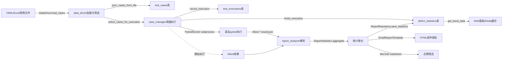

# TestMatrix core层架构设计文档

> 本文档详细说明 core 层（平台核心逻辑层）的架构设计、模块职责、关键设计决策与扩展点，
> 适合作为架构讲解与技术评审材料。2026-09-03 更新：补充通知模块设计与进阶能力规划
> （Redis/真实pytest执行/依赖编排/AST/AI扩展）。

## 1. 架构总览

core 层是平台的业务核心，负责测试用例的**数据驱动、调度执行、报告分析、通知推送**四大核心能力：

- **数据驱动层**（`data_driver`）：统一加载 YAML/Excel 用例数据，内存三维筛选
- **调度执行层**（`case_manager`）：用例入库、批次管理、分级执行、结果记录与汇总
- **报告分析层**（`report_analyzer`）：Allure 结果解析 → 统计聚合 → 持久化入库 → 趋势查询
- **通知推送层**（`notification`）：BaseNotifier 抽象基类 + 邮件/企微渠道 + 分级路由

### 1.1 完整数据流

文字版：用例文件 → data_driver 加载筛选 → case_manager 入库并调度执行（模拟执行器或 PytestRunner 真实执行）→ 执行明细与批次汇总落库 → Allure JSON → report_analyzer 解析统计入库 → Web 看板（Redis 缓存加速）与多渠道通知消费。

### 1.2 与其他层的关系

| 层 | 提供能力 | core层的消费方式 |
| --- | --- | --- |
| common 层 | LogManager 日志、env_manager 配置、HttpClient/Serial/Telnet 协议客户端、Assertion 断言库 | 全模块统一 `LogManager.get_logger()`；配置经 env_manager 注入 |
| db 层 | 3 张核心表 ORM 模型 + DatabaseSession 会话管理（SQLite/MySQL 双模式） | case_manager 顶部直接导入；report_analyzer/notification 函数内延迟导入（规避循环依赖） |
| web 层（开发中） | Flask API / SSE / 页面 | 通过调用 core 层公开方法触发调度与查询；Redis 作为缓存与任务队列（规划） |

## 2. 模块详细设计

### 2.1 data_driver 数据驱动引擎

**职责**：屏蔽 YAML/Excel 格式差异，对外提供统一的用例加载（`load_cases`）与三维筛选（`filter_cases`）能力，输出可直接用于 `pytest.mark.parametrize` 的列表结构。

**设计决策**：

1. **为什么支持 YAML 和 Excel 双格式？** 团队角色分工不同——测开习惯 YAML（版本友好、可 code review），业务测试习惯 Excel（零门槛填写）。统一入口按后缀自动分发，调用方零感知。
2. **为什么三维筛选用内存实现而不是 SQL 查询？** 数据加载层与持久层解耦：筛选发生在数据入库之前（参数化直用场景），内存筛选不依赖数据库连接，同时保证同一套筛选语义在文件与数据库两种数据源上行为一致。
3. **大数据量如何处理内存？** 当前 50 条量级实测单条加载+校验+规范化仅 0.55ms（吞吐约 1800 条/秒）；已预留分片加载扩展位（Day105 计划），万级用例再引入生成器逐批消费，避免过度设计。

**异常处理**：文件不存在/后缀不支持抛 `DataDriverError`；YAML 语法错误、字段校验失败的报错均携带**行号或用例序号 + 字段名**中文定位；Excel 空行自动跳过、空表头直接报错。

**进阶规划（Day136-138）**：接口依赖与编排——用例间依赖参数传递（登录 token 提取到变量池→后续用例引用）、场景化用例编排（登录→下单→查询多接口组合），失败自动跳过依赖用例。

### 2.2 case_manager 用例调度引擎

**职责**：用例加载入库（upsert）、批次创建与管理、分级执行调度、单条结果记录、批次汇总统计、CLI 命令行入口。

**设计决策**：

1. **批次号为什么用"时间戳+uuid4前4位"而不是数据库自增 ID？** ① 可读性——`RUN-20260824-213000-a1b2` 一眼可辨执行日期；② 唯一性不依赖数据库——CLI/CI/未来分布式节点本地即可生成；③ 进程内集合防碰撞重试（同秒 100 次理论碰撞率约 7% 降为 0）。
2. **分级执行如何设计？** "排序即调度"——`select_cases_for_execution` 复用 `list_cases` 的 priority 升序 + case_id 升序，执行顺序天然与风险等级对齐；tags 维度支持 smoke/regression 圈定回归范围。
3. **dry-run 模式为什么重要？** 执行计划可验证——上线新筛选条件前先预览待执行列表确认圈定范围；零副作用（不写任何表），CI 中可作冒烟前置检查。
4. **CLI 为什么用 argparse 而不是 click？** 标准库零依赖，`action="append"` 原生支持 `-p P0 -p P1` 多值传入；内部工具不引第三方依赖的供应链成本。

**异常处理**：批次号/用例编号/result 取值强校验（携带 context 定位上下文）；failed/error 结果强制要求 error_message；单用例失败不中断整批；SQLAlchemyError 统一包装向上抛出。

**进阶规划（Day118-135）**：`_simulate_execute` 单点替换为 `PytestRunner`——subprocess 封装真实 pytest（超时杀死/僵尸进程清理/退出码解析）、pytest 钩子（collection_modifyitems）与自定义插件、pytest-xdist 并发执行与乱序结果合并、多批次并发（资源竞争/锁/队列）。

### 2.3 report_analyzer 报告分析引擎

**职责**：三层分工——解析层（`ReportAnalyzer`）、计算层（`ReportStatistics`）、持久层（`ReportRepository`）。

**设计决策**：

1. **单个 JSON 损坏为什么跳过而不是中断整批？** Allure 产物由 pytest 并发生成，个别文件写坏是真实偶发情况；报告生成是全批次的后置消费环节，单文件脏数据不应让整体分析瘫痪。
2. **labels 为什么转 `Dict[str, List[str]]`？** 原始扁平数组每次统计都要遍历找目标标签；转字典后 `get_label("severity")` 一次命中，同 name 多 value（多 tag）自动合并。
3. **P95 为什么大样本百分位、小样本（<20 条）取最大值近似？** 样本不足时百分位无统计意义；取 max 是保守估计——性能报告宁可高估暴露风险，不低估制造虚假信心。
4. **模块名提取为什么四级 fallback（feature→suite→parentSuite→full_name）？** Allure 标签依赖用例编写规范性；逐级降级保证分组覆盖率 100%（unknown 兜底 + warning），分组总量守恒已由测试锁定。
5. **failed 与 broken 为什么分开映射到表内 failed/error 字段？** failed 是断言失败（功能缺陷疑似），broken 是环境/代码异常（非功能问题）；聚合层合计（执行健康度口径），入库拆回（缺陷归因口径），一次聚合两种口径都有。
6. **为什么用函数内延迟导入 db 层模型？** core 与 db 若互相顶部导入会形成循环依赖；导入时机推迟到调用瞬间，模块加载图保持无环。

**进阶规划**：大结果集流式解析与增量解析（Day103-104）；质量度量体系（覆盖率趋势/缺陷密度/执行效率，Day23 API + Day40 Dashboard）。

### 2.4 notification 通知推送引擎

**职责**：`Notification` 统一消息结构 + `BaseNotifier` 抽象基类（send/is_enabled/build_notification）+ `EmailNotifier`（smtplib，465 SSL/587 STARTTLS 自适应）+ `WeChatNotifier`（webhook markdown）+ `EmailReportTemplate`（内联 CSS 六区块 HTML 报告）。

**设计决策**：

1. **为什么抽象 BaseNotifier 基类？** 渠道可插拔——邮件/企微/未来钉钉统一 send 接口，调用方零感知渠道差异；新增渠道只需继承实现 send。
2. **send 为什么"失败内部捕获返回 False"而不是抛异常？** 通知是旁路能力，发送失败绝不影响主流程（批次执行/报告生成本体）；异常语义交给返回值，调用方按 bool 决定记录。
3. **邮件为什么用 smtplib 标准库而不是 yagmail？** 零第三方依赖、端口策略（SSL/STARTTLS/明文本地测试）完全可控；yagmail 的便利性不值得为一个内部工具引入依赖。
4. **HTML 为什么全部内联 CSS？** Outlook/Gmail 等邮件客户端会过滤 `<style>` 标签，内联样式是邮件 HTML 的事实标准。
5. **企微 markdown 的 HTML 怎么处理？** 企微不支持 HTML 标签，`_convert_to_markdown` 用正则去标签+还原实体+压缩空行降级为纯文本；通过率着色映射企微三色（info 绿/warning 橙/comment 灰）。
6. **webhook URL 为什么脱敏？** URL 含 key 属敏感信息，日志只打前 30 字符，防止密钥进日志被二次泄露。

**异常处理**：配置缺失/网络异常/业务失败（errcode≠0）/响应非 JSON 四层全部 error 日志+返回 False；企微网络请求 10s 超时防卡死；quit() finally 保证连接释放。

**进阶规划（Day13-14）**：分级通知策略（全量/仅失败）+ 失败@负责人；重试机制（指数退避 1/2/4/8s + 最大重试次数 + 死信记录入库）——分布式系统常见设计。

## 3. 数据模型

| 模型 | 层次 | 字段要点 |
| --- | --- | --- |
| `AllureResult` | 解析层 | 12 字段映射 result.json，`duration_ms` property |
| `StatisticsResult` | 计算层 | 15 字段批次级指标（含 by_module/by_priority/failed_details） |
| `ModuleStat` / `PriorityStat` / `FailedCaseDetail` | 计算层 | 分组统计与失败明细（10 字段） |
| `Notification` | 通知层 | 10 字段统一消息（title/content/level/pass_rate/extra） |
| `TestCase` / `TestExecution` / `DefectStatistic` | 持久层 | 三张核心表；execution_id 唯一约束保证批次统计唯一性 |

## 4. 进阶能力架构（规划中）

| 能力 | 交付日 | 架构设计 |
| --- | --- | --- |
| Redis 缓存与队列 | Day31-33 | 缓存层（统计结果/用例列表，TTL+穿透防护）+ 任务队列（异步执行替代裸线程）；故障降级回退直查 DB |
| 真实 pytest 执行 | Day118-135 | PytestRunner（subprocess 封装）+ 钩子/自定义插件 + xdist 并发；与模拟执行器同构可切换 |
| 接口依赖编排 | Day136-138 | 变量池（token 提取/引用）+ 场景编排（多接口组合）；失败跳过依赖用例 |
| AST 静态分析 | Day115-116 | 用例代码质量检查：命名规范/必填字段/重复用例/复杂度，CLI 输出报告 |
| AI 用例生成预留 | Day170 | `AICaseGenerator` 抽象类定义 `generate_cases` 接口 + Mock 实现，后续可接 LLM |

## 5. 扩展点

| 模块 | 扩展方向 | 预留设计 |
| --- | --- | --- |
| data_driver | 新格式（JSON/CSV/数据库源） | 后缀分发的解析器注册模式；CSV 已排期 Day105 |
| case_manager | 并发执行/分布式执行 | 执行器单点替换位（_simulate_execute→PytestRunner）；批次号无 DB 依赖 |
| report_analyzer | 新报告格式（JUnit XML/HTML） | 解析层与计算层以 `List[AllureResult]` 为边界解耦 |
| notification | 新渠道（钉钉/飞书/Slack） | 继承 BaseNotifier 实现 send 即可，统一路由与重试 |

## 6. 测试覆盖

| 模块 | 测试文件 | 条数 | 核心覆盖 |
| --- | --- | --- | --- |
| data_driver | tests/api_demo/test_data_driver_demo.py | 11 | 双格式加载/字段校验定位/三维筛选 |
| data_driver 大数据量 | tests/api_demo/test_data_driver_bulk.py | 53 | 50 条混合数据集/性能基线/筛选交叉验证 |
| case_manager | tests/api_demo/test_case_manager_demo.py | 9 | upsert 入库/多维度查询/批次号唯一性 |
| case_manager 调度 | tests/api_demo/test_case_manager_schedule_demo.py | 14 | 批次创建/筛选/结果记录/汇总幂等/端到端 |
| case_manager CLI | tests/api_demo/test_case_manager_cli_demo.py | 10 | run_batch 链路/dry-run/CLI 参数与退出码 |
| report_analyzer 解析 | tests/test_report_analyzer_demo.py | 12 | 扫描过滤/字段解析/损坏容错/状态筛选 |
| report_analyzer 统计 | tests/test_report_statistics_demo.py | 13 | 计数/P95 大小样本/分组/提取链/序列化 |
| report_analyzer 仓储 | tests/test_report_repository_demo.py | 10 | 字段映射/唯一约束/趋势/超长 remark |
| notification 基座 | tests/test_notification_demo.py | 11 | 抽象约束/配置解析/SSL 与 TLS 路径/认证容错 |
| notification 模板 | tests/test_email_template_demo.py | 9 | HTML 结构/颜色阈值/表格渲染/边界容错 |
| notification 企微 | tests/test_wechat_notifier_demo.py | 11 | payload 格式/业务失败/网络容错/URL 脱敏 |
| core 边界补全 | tests/test_core_edge_cases.py | 16 | 损坏 YAML/空 sheet/dry-run 不落库/趋势边界 |

**合计 179 条 core/notification 相关测试**（全量 189 条 pytest 基线），关键设计决策（failed/broken 双口径、P95 小样本近似、分组守恒、dry-run 零副作用、通知失败不外抛）均有测试锁定。

---

*文档生成于 2026-08-30（Day9），2026-09-03（Day12）更新：补充通知模块设计与进阶能力规划。对应代码提交：908c6a3。*
