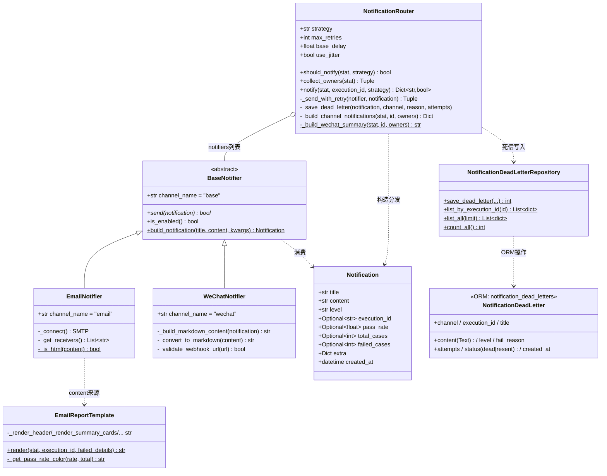

# 通知模块架构文档（notification_architecture.md）

> 模块：`src/core/notification.py`（约 1642 行）+ `src/db/models.py::NotificationDeadLetter`
> 交付周期：第二阶段 Day10-Day15（2026-08-31 ~ 2026-09-05），本文档为 Day16 review 日产出

---

## 1. 模块定位与能力边界

**定位：通知是测试执行主流程的"旁路能力"**——批次执行成功与否、报告生成与否，永远不因通知渠道故障而受影响。这条铁律贯穿全部实现：

- `send()` 契约：单次尝试、失败内部吞异常、只返回 `bool`、绝不向上抛
- 调用侧防护：双层 try（`notify_execution_result` 方法内 + `run_batch` 调用处）
- 死信落库：死信写入自身故障（DB 挂）也只记 error 日志，"旁路的旁路"

**六天演进路径：**

| 天 | 交付 | 核心类/方法 |
| --- | --- | --- |
| Day10 | 抽象基座 + 邮件通知器 | `Notification` / `BaseNotifier` / `EmailNotifier`（smtplib 端口自适应） |
| Day11 | HTML 邮件报告模板 | `EmailReportTemplate`（内联 CSS 六区块） |
| Day12 | 企业微信机器人 | `WeChatNotifier`（markdown 消息 + URL 脱敏） |
| Day13 | 分级策略 + @负责人 + 路由器 | `NotificationRouter`（should_notify / collect_owners / notify） |
| Day14 | 指数退避重试 + 死信 | `_send_with_retry` / `NotificationDeadLetterRepository` / 第4张表 |
| Day15 | 执行链路集成 | `CaseManager.build_notification_statistics`（适配器）/ `notify_execution_result` / CLI `--notify` |

**能力边界（明确不做）：** 用户体系/权限、钉钉/飞书渠道（架构已预留）、死信重放（status=resent 仅占位）、复杂富文本转换。

---

## 2. 类关系图



---

## 3. 数据流图：批次完成 → 通知送达/死信

```mermaid
flowchart TD
    A[批次执行完成<br/>run_batch 第7步汇总] -->|notify=True| B[CaseManager.notify_execution_result<br/>第一层try兜底]
    B --> C[build_notification_statistics 适配器]
    C --> C1[查 test_executions 批次记录<br/>无记录返回None→{}]
    C1 --> C2[IN批量查 test_cases<br/>case_id→module,priority 字典]
    C2 --> C3[逐条转 AllureResult<br/>error→broken / 秒→毫秒]
    C3 --> C4[ReportStatistics.aggregate<br/>唯一统计入口]
    C4 --> D{NotificationRouter.notify<br/>第二层防护}
    D -->|strategy=all| E[总是发送]
    D -->|strategy=failed_only| F{stat.failed > 0?}
    F -->|否| G[跳过通知 返回~]
    F -->|是| E
    E --> H[collect_owners<br/>owner标签去重/手机号分流/@all]
    H --> I[_build_channel_notifications<br/>邮件HTML + 企微markdown摘要]
    I --> J[邮件渠道 _send_with_retry]
    I --> K[企微渠道 _send_with_retry<br/>payload注入mentioned_*]
    J --> L{尝试成功?}
    K --> L
    L -->|是| M[results~channel~=True]
    L -->|否 退避1/2/4/8s重试| N{耗尽?}
    N -->|未耗尽| J
    N -->|耗尽| O[_save_dead_letter<br/>第三层兜底:落库失败仅error日志]
    O --> P[results~channel~=False<br/>notification_dead_letters表]
    M --> Q[返回结果字典<br/>不影响run_batch返回值]
    P --> Q
```

**关键口径：** 统计数字与 Web 看板、defect_statistics 表同源（aggregate 唯一入口）；DB 四态→Allure 四态映射中 `error→broken` 与 Day8 入库映射（`failed=合计-broken`、`error=broken`）互为逆过程，双向自洽。

---

## 4. 关键设计决策清单

| # | 决策 | 理由（2-3句） |
| --- | --- | --- |
| 1 | **send 失败吞异常返回 bool，绝不外抛** | 通知是主流程旁路，抛异常会让成功批次整体失败。契约写进 ABC 强制所有渠道遵守。 |
| 2 | **SMTP 端口自适应**（465→SMTP_SSL / 587→STARTTLS / 其他→明文） | 同一套代码覆盖生产 SSL、云服务商 TLS 与本地 MailHog 测试；finally quit 防长跑进程连接泄漏。 |
| 3 | **邮件 HTML 全内联 CSS + 600px** | Outlook/Gmail 过滤 `<style>` 标签与外链样式，内联是邮件 HTML 事实标准；窄屏邮件客户端占比高。 |
| 4 | **企微@人走 payload 注入** | markdown 正文 `<@xxx>` 不触发提醒，必须在顶层 `mentioned_list`/`mentioned_mobile_list`；正文仅保留视觉展示行。 |
| 5 | **重试归 Router 不进渠道 send** | 重试是发送策略；send 保持"单次尝试"纯语义，N 个渠道零重复代码，策略改动单点生效。 |
| 6 | **指数退避 + 可选 jitter** | base×2^(k-1)（1/2/4/8）给故障方喘息；jitter 打散多实例同步重试雪崩；默认关保证测试确定性；最后一次失败不空等。 |
| 7 | **死信留痕（第4张表）** | content 用 Text 存全文支持人工重发；status 预留 dead/resent 但不提前实现重放（开闭原则）；死信写入失败仅 error——旁路的旁路。 |
| 8 | **适配器复用统计层** | DB 记录→AllureResult→aggregate，统计口径全项目唯一；重写统计必然口径分叉。 |
| 9 | **sleeper/repo 构造注入** | 测试传记录型 fake，零真实 sleep、零真实网络；坏 repo 注入验证第三层兜底。 |

---

## 5. 配置项全表

| 变量 | 作用 | 默认值 |
| --- | --- | --- |
| `TM_EMAIL_ENABLED` | 邮件渠道总开关 | `false` |
| `TM_EMAIL_SMTP_HOST` | SMTP 服务器地址 | — |
| `TM_EMAIL_SMTP_PORT` | 端口（465/587/其他自适应协议） | `465` |
| `TM_EMAIL_SENDER` | 发件人邮箱 | — |
| `TM_EMAIL_PASSWORD` | 发件人授权码 | — |
| `TM_EMAIL_RECEIVERS` | 收件人列表（逗号分隔，去空去重保序） | — |
| `TM_WECHAT_ENABLED` | 企微渠道总开关 | `false` |
| `TM_WECHAT_WEBHOOK_URL` | 机器人 webhook 完整 URL（含 key，日志脱敏打印） | — |
| `TM_NOTIFY_STRATEGY` | 通知策略：`all` 每次通知 / `failed_only` 仅有失败时 | `all` |
| `TM_NOTIFY_AT_ALL` | 存在失败时是否@所有人 | `false` |
| `TM_NOTIFY_OWNER_MOBILES` | 额外@手机号列表（逗号分隔，合并去重） | 空 |
| `TM_NOTIFY_MAX_RETRIES` | 失败后最大重试次数（首次不计；非法值含 bool 按0） | `3` |
| `TM_NOTIFY_RETRY_BASE_DELAY` | 退避基准秒数（序列 base×2^k） | `1.0` |
| `TM_NOTIFY_RETRY_JITTER` | 重试等待加随机抖动（防雪崩） | `false` |

---

## 6. 扩展新渠道指南（三步）

以接入钉钉机器人为例：

```python
class DingTalkNotifier(BaseNotifier):
    channel_name = "dingtalk"          # 步骤1: 渠道名（结果字典的键）

    def send(self, notification) -> bool:
        try:
            # 步骤2: 实现单次发送（一次尝试，不写重试循环）
            ...
            return response.json().get("errcode") == 0
        except Exception as exc:       # 步骤3: 异常吞掉记日志，只返回bool
            logger.error(f"钉钉通知失败: {exc}")
            return False
```

**Router 自动纳管：** 无需改 Router 代码——构造函数默认 `notifiers=None` 时按需追加实例，或显式传入 `[..., DingTalkNotifier()]`；重试/@人策略注入 `notification.extra`（钉钉可在 send 内消费 `mentioned_mobile_list` 映射为钉钉的 at.mobiles）；重试耗尽自动落死信表（channel 列区分渠道）。`.env.example` 加 `TM_DINGTALK_*` 配置块，`is_enabled()` 读对应开关即可。

---

## 附录A：核心组件职责速查（类与关键方法一句话职责）

- **Notification**：全渠道统一的消息信封（标题/正文/级别/批次关联/统计字段/@人扩展位）
- **BaseNotifier**：旁路契约的载体——抽象 send，规定"单次尝试、吞异常、返 bool"
- **EmailNotifier**：标准库 smtplib 发邮件，端口自适应选协议，finally quit 防泄漏
- **EmailReportTemplate**：StatisticsResult → 内联 CSS 的 HTML 报告（六区块，负责人列）
- **WeChatNotifier**：企微 webhook markdown 推送，payload 注入@人名单，URL 日志脱敏
- **NotificationRouter**：通知大脑——要不要发（策略）、@谁（负责人收集）、怎么发（重试）、发砸了怎么办（死信）
- **NotificationDeadLetterRepository**：死信表 CRUD（延迟导入破循环依赖）
- **NotificationDeadLetter**（ORM）：重试耗尽的消息全文留痕，status 预留重放扩展位
- **CaseManager.build_notification_statistics**：适配器——DB 记录转 AllureResult 复用唯一统计入口
- **CaseManager.notify_execution_result**：集成入口——建统计→交 Router，方法内全量 try

## 附录B：设计决策问答（18 问，覆盖通知模块全链路设计）

1. 通知发送失败为什么不能抛异常？抛了会怎样？
2. "旁路能力"这个定位是怎么落进代码的？契约层面和调用层面分别怎么保证？
3. 为什么用标准库 smtplib 而不是 yagmail？端口自适应解决什么场景？
4. finally 里 quit() 防的是什么问题？什么进程形态下会真出事？
5. 邮件 HTML 为什么不能用 `<style>` 标签和外链 CSS？内联 CSS 写起来啰嗦怎么缓解？
6. 企微群里@一个人，payload 到底怎么写？写 markdown 正文里为什么没用？
7. 手机号和 userid 怎么分流的？@all 和额外手机号配置怎么合并的？
8. webhook URL 为什么日志要脱敏？你怎么保证脱敏不是口头约定？
9. 重试为什么不写在每个渠道的 send 里？写在 send 里有什么维护代价？
10. 退避序列怎么算的？为什么最后一次失败后不再等？为什么要 jitter、又为什么默认关？
11. max_retries 校验为什么要单独排除 bool？isinstance(True, int) 返回什么？
12. 什么是死信？死信表为什么要存完整消息体？status 预留 resent 但不实现是什么原则？
13. 死信写入本身失败了怎么办？为什么连这个也不能往外抛？
14. 防御性 try 吞掉 NameError 那个坑，表象是什么？怎么定位的？两条教训分别是什么？
15. 执行记录在 test_executions 表、通知要 StatisticsResult，中间怎么桥接？为什么不重写一套统计？
16. DB 的 error 和统计层的 broken 为什么是同一个东西的两面？入库映射和出库映射分别是什么？
17. module/priority 怎么补全的？为什么用 IN 批量查而不是逐条查？缺失了怎么办？
18. 旁路防护为什么要做双层？测试是怎么逼出 run_batch 调用处缺 try 这个缺口的？

---

*本文档生成于 2026-09-06（Day16 review 日），基于提交 09063e3。*
