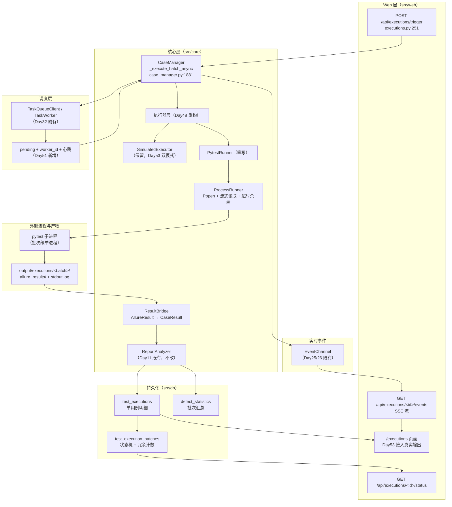

# TestMatrix 真实执行器接入方案设计（Day45）

> **文件性质**：设计文档（设计日产出，Day45 不含任何 `src/` 实现代码）
> **适用范围**：真实执行器 Phase-1（Day46-54），为后续 9 天的实现提供唯一设计依据
> **关联 ADR**：`docs/adr/ADR-001-real-executor-integration.md`（关键决策点与备选方案）
> **关联实验**：`scripts/ast_regression_poc.py` + `tests/test_ast_regression_poc.py`（AST 精准回归 POC 实验代码）

---

## 1. 背景与目标

### 1.1 为什么要做真实执行器

平台至今 44 天，执行链路上的每一次"执行"都来自 `SimulatedExecutor`（奇偶规则造结果）。
`PytestRunner` 虽在 Day24 搭好了骨架，但**从未真跑通过一条测试**，也没有任何一条
用例的 `script_path` 指向真实测试文件。Day52 验收门禁要求"真跑一条 `assert True`
通过 + 结果入库 + Web 可见"，因此 Phase-1 的目标是把这条链路从"骨架"变成"可用"。

### 1.2 现有实现的三个硬缺口（源码实证）

设计前逐行读了 `src/core/executors.py` / `src/core/case_manager.py` /
`src/web/routes/executions.py` / `src/core/report_analyzer.py` / `src/db/models.py`，
确认三个必须先解决的缺口——它们不是"待优化项"，而是会让真实执行**功能性不可用**的问题。

**缺口一：进程模型错配，每条用例一个 pytest 进程。**
`PytestRunner.build_command()`（`executors.py:186`）+ `run_one()`（`executors.py:220`）
是"一次调用跑一条用例"，编排层 `CaseManager._execute_batch_async`
（`case_manager.py:1971-1988`）在 `for case in cases:` 里逐条调 `run_one`。

Day45 实测（Windows + PowerShell，venv 环境）：

| 场景 | 墙钟耗时 | 说明 |
| --- | --- | --- |
| 单个测试文件 `test_api_health.py`（1 条用例） | 1595 ms | 其中 0.54s 是 pytest 自身报告的耗时，余下为解释器启动 + 插件加载 |
| 整个 `tests/api_demo` 目录（107 条用例） | 7203 ms | 一次进程内跑 107 条 |
| 全量 1180 条（单进程，历史实测） | 约 70 s | 约 0.06 s/条 |

即**每个 pytest 进程有约 1.6 s 的固定启动开销**。按当前"每用例一进程"模型，
1180 条用例仅启动开销就是 1180 × 1.595 s ≈ **31.4 分钟**（不含用例自身耗时），
是单进程全量跑（约 70 s）的 **27 倍**。且每条用例都要重复 `conftest.py` 导入、
pytest 插件加载、Allure 环境初始化。

**缺口二：`script_path` 是悬空契约，真实执行必然全量 error。**
`build_command()` 取路径的代码是（`executors.py:201`）：

```python
path = str(case.get("script_path") or case.get("case_id", ""))
```

但全仓 grep 显示：`script_path` **只出现在 `executors.py` 的这一行与 4 个测试文件里**，
`src/db/models.py` 的 `TestCase` 没有该列，`CaseManager._to_dict()`
（`case_manager.py:2601-2626`）也不产出该键。也就是说：

- 生产链路里 `case.get("script_path")` **恒返回 `None`**（`TestCase` 无此字段、
  `_to_dict` 也不产出，字典取不到键时 `.get` 不会抛 `KeyError`），
  于是 `or` 表达式永远回落到 `case_id`；
- 于是命令变成 `pytest -q --tb=short -- TM-API-0001`；
- pytest 报 `file or directory not found: TM-API-0001`，退出码 **4**；
- 退出码 4 落在 `run_one()` 的"其他退出码 → error"分支（`executors.py:291-302`）。

**结论：`TM_EXECUTOR=pytest` 下每一条用例都会落 error，一条都跑不通。**
这与 Day44 P1-01（`--` 终止符位置错误导致同类后果）是同一个缺陷家族，
而三条测试（`test_day43_closing_demo.py:127`、`test_day44_bugfix_demo.py:148`、
`test_stage_c_support_coverage_demo.py:404`）**恰恰断言的是这个从未被兑现的契约形状**
（都手工传入含 `script_path` 的字典），所以缺陷在 CI 下一直是绿的。
这正是 `source_ref` 字段必须最先落地的原因（见第 5 章）。

**缺口三：`capture_output=True` 拿不到过程输出，SSE 流式展示无米下锅。**
`run_one()` 用 `subprocess.run(..., capture_output=True)`（`executors.py:244`），
输出要等进程**完全退出**才一次性拿到。Day53 要求"SSE 真实输出流式展示"，
当前实现下前端在批次运行期间收不到任何一行 pytest 输出。

**缺口四（次要）：超时不杀进程树。**
`subprocess.run(timeout=30)` 超时后只终止直接子进程。真实执行会带
`pytest-xdist`（requirements.txt 已有 `pytest-xdist==3.5.0`）与 allure 插件，
Windows 上残留的 xdist worker 进程会继续占用 `output/allure_results`，
直接引发 Day39 起反复出现的 `WinError 145 / INTERNALERROR`
（`--clean-alluredir` 删不掉占用中的目录，pytest.ini 注释已专门记录该坑）。

### 1.3 Day46-54 整体规划与本设计的边界

| 天 | 任务 | 本设计对应章节 |
| --- | --- | --- |
| Day46 | `source_ref` 字段改造（ORM + 迁移） | 第 5 章 |
| Day47 | 存量回填 + 用例录入改造（YAML/Excel 新增列） | 5.3 / 5.4 |
| Day48 | PytestRunner 封装（subprocess + 超时 + 输出捕获） | 第 3 章 |
| Day49 | 执行器稳定性（超时杀进程树 + 退出码解析 + 参数化透传） | 3.3 / 3.5 / 6.2 |
| Day50 | 输出解析 + Allure 结果桥接 | 第 4 章 |
| Day51 | 执行状态回写 + 任务队列 ACK/requeue | 第 6 章 |
| Day52 | **验收门禁（硬性）** | 第 9 章 |
| Day53 | 全链路联调 + SSE 流式 + 双模式切换 | 第 7 章 |
| Day54 | 联调 bug 修复 + 复盘 | — |

**今天不做**（Day45 是设计日，`src/` 零改动）：不写执行器实现、不改 ORM、
不改任务队列、不动前端。

---

## 2. 整体架构

### 2.1 架构图



### 2.2 各环节职责边界

| 环节 | 职责 | 明确**不**负责 | 落点 |
| --- | --- | --- | --- |
| Web 路由 | 参数校验、受理、投队列、202 应答 | 不碰执行细节、不做结果解析 | `routes/executions.py`（Day48 零改动） |
| 调度层 | 任务投递、ACK、崩溃重投、心跳 | 不理解用例内容 | `core/task_queue.py`（Day51 扩 pending） |
| 编排层 | 批次状态机、逐条落明细、SSE 埋点、通知 | 不解析 pytest 输出 | `case_manager._execute_batch_async`（Day48 零改动） |
| 执行器层 | 拼命令、起进程、管超时、读流、产出结构化结果 | 不写库、不发事件 | `core/executors.py`（Day48 重写） |
| 桥接层 | Allure 产物 → 平台结果模型 | 不起进程 | Day50 新增（建议 `core/result_bridge.py`） |
| 报告层 | 统计聚合、缺陷分析 | 不认识 pytest | `core/report_analyzer.py`（零改动复用） |

**分层铁律**：编排层只依赖 `BaseExecutor` 抽象契约（Day24 已确立），
因此 Day48-51 的所有实现细节变更对 `case_manager.py` 零影响——
**这就是 6.13 当日"Day52-61 接真实执行器时编排代码零改动"承诺的兑现方式**。

### 2.3 数据流（一条用例的完整旅程）

```
用例(含 source_ref)
  → PytestRunner.build_command  → 命令列表
  → ProcessRunner 起进程       → stdout/stderr 逐行
  → 实时进度解析（仅供 SSE）    → case_progress 事件
  → 进程退出 + 产物落 output/executions/<batch>/
  → ResultBridge 读 allure_results/*.json
  → ReportAnalyzer.parse_results_dir → list[AllureResult]
  → 状态映射 + traceback 解析   → CaseResult
  → record_execution 落 test_executions（逐条）
  → case_finished 事件 → SSE
  → finish_execution 聚合 → defect_statistics
  → batch_finished 事件 → 关闭通道 → 通知
```

---

## 3. subprocess 封装方案

### 3.1 进程模型：批次级单进程（决策点，见 ADR-001）

**决策**：一个批次 = 一个 pytest 子进程。

命令形态（Day48 实现基准）：

```python
[
    sys.executable, "-m", "pytest",
    "-p", "no:cacheprovider",
    "-q", "--tb=long",
    "--alluredir", str(batch_dir / "allure_results"),
    "--junitxml", str(batch_dir / "junit.xml"),
    "--", *target_paths,          # 多个目标（用例的 source_ref 去重）
]
```

要点与理由：

1. **`--` 必须在所有选项之后、目标路径之前**（Day44 P1-01 的教训，不可再犯）。
   argparse 在 `--` 之后停止解析选项，其后全部元素都是位置参数。
2. **目标路径由 `source_ref` 提供**（第 5 章），多用例的 `source_ref` 去重后
   一次性传入，让 pytest 一次收集并跑完。**不再逐条起进程**。
3. **保留单用例模式**：`case_type=chip`（串口/telnet 用例）需要独占硬件，
   仍走"一条用例一个进程"，但这是显式例外而非默认路径。
4. **`--alluredir` 必须指向批次隔离目录**，不能是共享的 `output/allure_results`
   （理由见 3.6）。

**为什么不是"每用例一进程"**：见 1.2 缺口一的实测数据（31.4 分钟 vs 70 秒）。
**为什么不是"in-process 调用 pytest.main()"**：`pytest.main()` 会在 worker 线程里
安装全局 trace/插件状态，多次调用存在状态残留与插件重复注册问题，
且无法隔离崩溃；`subprocess` 是唯一能让"pytest 崩溃"不影响平台进程的方式。

### 3.2 命令拼装的安全性约束

- **绝不把 `case_id` 直接当路径**（缺口二）。目标路径只能来自 `source_ref`，
  且入库前经 `DataDriver.CASE_ID_PATTERN`（`data_driver.py:62`）同级校验。
- 路径必须落在项目根内：`Path(target).resolve().relative_to(PROJECT_ROOT)`
  失败即拒绝执行（防路径穿越）。
- 环境变量透传白名单：不透传子进程继承的任意 `TM_*`（避免子进程里的
  平台配置影响被测代码），只显式设置下节列出的那几个。

### 3.3 超时控制（三层防线）

单一 `subprocess.run(timeout=)` 不足以覆盖真实场景（Day49 重点）：

| 层级 | 超时对象 | 默认值 | 越界动作 |
| --- | --- | --- | --- |
| L1 批次级 | 整个 pytest 进程 | `TM_PYTEST_BATCH_TIMEOUT`（默认 3600 s） | 终止进程树 → 批次 `failed` |
| L2 用例级 | 单条用例（由 allure `stop-start` 事后判定） | `TM_PYTEST_CASE_TIMEOUT`（默认 300 s） | 标记该条 `error` + 写超时说明 |
| L3 无响应 | 读取流时长时间无新输出 | `TM_PYTEST_IDLE_TIMEOUT`（默认 900 s） | 终止进程树（防死锁） |

**杀进程树的具体做法**（Windows / POSIX 分支）：

```python
# Windows: 建独立进程组，taskkill /T 杀整棵树
proc = subprocess.Popen(cmd, stdout=PIPE, stderr=STDOUT,
                        creationflags=subprocess.CREATE_NEW_PROCESS_GROUP)
def kill_tree(proc):
    subprocess.run(["taskkill", "/F", "/T", "/PID", str(proc.pid)],
                   capture_output=True)
# POSIX: 先杀子进程组，再杀主进程
os.killpg(os.getpgid(proc.pid), signal.SIGKILL)
```

**为什么不能只用 `proc.kill()`**：它只终止主进程。`pytest-xdist` 的 worker 是
孙进程，pytest 被杀后 worker 继续存活并**继续写 `output/allure_results`**，
下次运行 `--clean-alluredir` 就会撞 `WinError 145`（Day39 起的老坑，
Day50 引入批次隔离目录后风险面进一步扩大，必须 L1/L3 都杀树）。

**看门狗线程**：用 `threading.Timer` 或读取线程内的单调时钟检查，
不要用 `time.sleep` 轮询主线程（会阻塞流式读取）。

### 3.4 输出捕获与流式

```python
proc = subprocess.Popen(
    cmd, stdout=subprocess.PIPE, stderr=subprocess.STDOUT,
    text=True, encoding="utf-8", errors="replace", bufsize=1,
    # cwd 必须是**项目根**，不是批次目录（3.6 表格 + ADR 决策 4 的唯一口径）：
    # pytest 依赖项目根的 pytest.ini（testpaths/pythonpath=.）与 conftest.py，
    # 改 cwd 会让 pythonpath=. 失效、用例 import 不到 src。隔离靠 batch_dir
    # 承载产物（alluredir/junit/日志/tmp），不靠工作目录。
    cwd=str(PROJECT_ROOT), env=child_env, creationflags=NEW_PROCESS_GROUP,
)
for line in proc.stdout:          # 逐行，天然流式
    ring.append(line)             # 环形缓冲（留尾部 N 行）
    full_log.write(line)          # 完整落盘
    progress_parser.feed(line)    # 实时进度（仅供 SSE，不作结果来源）
```

设计要点：

- **合并 stderr 到 stdout**：pytest 的进度与失败信息主要走 stdout，
  分开捕获会**丢失二者的相对顺序**，实时展示时"错误先于失败出现"很难解释。
  退出码已足够区分用法错误（4）与测试失败（1）。
- **编码固定 `utf-8` + `errors="replace"`**：沿用 `executors.py:50-51` 已固化的常量
  （`SUBPROCESS_ENCODING` / `SUBPROCESS_ERRORS`），Windows cp936 遇 UTF-8 中文
  用例名会抛 `UnicodeDecodeError` 并穿透到批次级 except。
- **双写**：完整输出落 `output/executions/<batch>/stdout.log`（可事后追溯），
  内存只留环形缓冲尾部（`executors.py:54` 的 `truncate_output_tail` 已有
  "取尾部"的正确实现，直接复用其思路）。
- **`bufsize=1`（行缓冲）**：否则管道缓冲会让"流式"退化成"攒够 4KB 才吐"。

### 3.5 退出码语义映射

pytest 退出码契约与平台结果的映射（替换 `executors.py:272-302` 的三分支）：

| pytest 退出码 | 含义 | 批次结果 | 说明 |
| --- | --- | --- | --- |
| 0 | 全部通过 | `finished` | 明细里可能仍有 skipped |
| 1 | 存在失败用例 | `finished` | 逐条结果以 allure 产物为准，不用退出码推断 |
| 2 | 中断（Ctrl-C / `Interrupted`） | `failed` | 写"执行被中断" |
| 3 | 内部错误（INTERNALERROR） | `failed` | 写 stderr 尾部（**典型如 WinError 145**） |
| 4 | 用法错误（路径不存在/选项非法） | `failed` | **缺口二的必然后果**，须写明具体路径 |
| 5 | 未收集到任何测试 | `failed` | 空跑不算成功 |
| 其他/负数 | 进程被杀（`-N` = 信号） | `failed` | 写"被信号终止" |

**铁律**：退出码只决定**批次**状态，**单条用例结果一律以 allure 产物为准**。
退出码 1 不代表"全部失败"，必须逐条读产物——这正是缺口二当年把
"退出码 0 → passed"当权威判定的教训。

### 3.6 工作目录与环境变量隔离

| 项 | 取值 | 理由 |
| --- | --- | --- |
| `cwd` | **项目根** | pytest 依赖 `pytest.ini`（`testpaths`/`addopts`）与 `conftest.py`；改 cwd 会让 `pythonpath=.` 失效，测试 import 不到 `src` |
| `--alluredir` | `output/executions/<execution_id>/allure_results` | 批次隔离：否则并发批次互相覆盖，且 `ReportAnalyzer.scan_results_dir` 会把多个批次的用例混进同一份统计 |
| `TMPDIR`/`TEMP` | `output/executions/<execution_id>/tmp` | 串口/临时文件不污染全局 temp |
| `PYTHONIOENCODING` | `utf-8` | 配合 `errors="replace"` 双保险 |
| `PYTHONDONTWRITEBYTECODE` | `1` | 避免子进程写 `__pycache__` 与主进程抢文件锁 |
| `TM_DB_*` | **显式指向执行专用库** | 真实执行会真调业务代码，让它连主库是事故；执行库独立（Day48 决策） |
| 其余 `TM_*` | **不透传** | 被测代码不应看到平台配置 |
| `PYTEST_ADDOPTS` | **清空** | 环境里的历史附加参数会污染命令（外部 CI 常注入 `--cov`，导致结果目录不一致） |
| `PYTEST_CURRENT_TEST` | 保留 | pytest 自己用 |

**工作目录隔离的两个层次要分清**（Day49 常见误解）：`cwd` **不是**隔离手段
（必须是项目根才能收集到用例）；真正的隔离是**产物目录**（alluredir/junit/日志/tmp）
按批次切分。收尾时整目录归档或删除。

---

## 4. 结果桥接方案

### 4.1 三种解析策略对比（决策点，见 ADR-001）

| 维度 | 行级解析终端输出 | JUnit XML（`--junitxml`） | Allure 结果目录（`--alluredir`） |
| --- | --- | --- | --- |
| 结构化程度 | 低（正则扒文本） | 中（XML 有固定 schema） | 高（JSON，字段最全） |
| 真实 traceback | 需从终端文本里二次切分 | 有 `failure` 文本但**不含 allure 附件/参数** | `statusDetails.trace` **原样完整堆栈** |
| 参数化用例 | 需解析 `[...]` 后缀，脆 | 有 `classname`+`name` | 有 `parameters` 结构化数组 |
| 耗时/时间戳 | 只能靠汇总行 | 有 `time` | 有 `start`/`stop` 毫秒时间戳 |
| 标签（severity/feature） | 无 | 无（自定义 property 需自己塞） | **原生 labels** |
| 既有代码复用 | 无 | 无 | **`ReportAnalyzer` 已完整实现**（Day11） |
| 新增依赖 | 无 | 无 | 无（`allure-pytest` 已在 requirements） |
| 抗 pytest 版本变更 | **极差** | 中（JUnit 是 pytest 长期稳定输出） | 中高（allure 格式有版本但字段兼容性好） |
| 实时进度 | **唯一可行** | 不可（文件写完才完整） | 不可（同左） |

**决策：结果来源 = Allure 结果目录（主）+ JUnit XML（兜底）；行级解析只做实时进度，
绝不作为结果来源。**

理由三条：
1. **既有资产复用**：`ReportAnalyzer.parse_results_dir` / `AllureResult`
   （`report_analyzer.py:78/246`）已把容错、标签合并、耗时统计写好并被 1207 条测试覆盖，
   真实执行只是**换一个数据来源喂给它**，不是新写一套解析器。
2. **行级解析不能作权威源**：`-q` 级别、终端宽度换行、颜色转义、xdist 前缀
   （`[gw0] `）都会改变文本形状；pytest 每次改版都可能让正则失配。
   Day45 写这个 POC 时已吃过一次同族亏：命令行里把 `-p` 放在 `--` 之后，
   直接被当路径报 `file or directory not found: -p`——**命令的文本形状极脆**。
3. **JUnit XML 作为兜底**：当 `allure-pytest` 未安装/插件加载失败时，
   仍能拿到"哪条失败 + 失败文本"，不至于整批次无结果。JUnit 是 pytest 的稳定输出。

### 4.2 Allure 结果桥接链路

```
output/executions/<batch>/allure_results/*-result.json
  → ReportAnalyzer.scan_results_dir(dir)      # 排序取全部 *-result.json
  → ReportAnalyzer.parse_results_dir(dir)     # → list[AllureResult]（已容错）
  → ResultBridge.to_case_results(results)     # 平台模型 + 状态映射 + traceback 解析
  → CaseManager.record_execution(...)         # 逐条落 test_executions
```

`ResultBridge`（Day50 新增，建议 `src/core/result_bridge.py`）只做三件事，
**不碰数据库、不起进程**：
`AllureResult` → `(case_id, result, duration, error_message, source_ref)` 的纯映射。

**用例归属（case_id）如何确定**：Allure 的 `fullName`/`name` 是 pytest 侧的
`tests/xxx.py::test_y`，而平台的 `case_id` 是业务编号（`TM-API-0001`）。
两者靠 **`source_ref` 关联**（第 5 章的核心职责）：

1. 优先取 allure 标签 `feature`/`story` 上按约定写入的业务编号；
2. 无标签时按"该 result 的 `fullName` 前缀文件路径 → 平台 `source_ref` → 用例"反查；
3. 仍匹配不上 → 记 `unmatched` 计数并写批次日志，**不静默丢弃**
   （丢弃会让通过率虚高）。

**参数化与平台用例的关系**：一个平台用例可能对应多条 allure result（多组参数）。
Day52 门禁前先按"文件级归属 + 结果按 (source_ref, 批次) 聚合"落库，
逐参数细分留 Day55+（钩子进阶）。**一期的口径必须写进 docstring**，防后期误读。

### 4.3 状态映射

| Allure `status` | 平台 `result`（test_executions） | 统计层（6.3 双向映射） |
| --- | --- | --- |
| `passed` | `passed` | passed |
| `failed` | `failed` | failed |
| `broken` | `error` | **broken** |
| `skipped` | `skipped` | skipped |
| `unknown` | `error` | broken |

6.3 已固定"DB 的 `error` ↔ 统计层 `broken`"双向映射，**Allure 的 `broken` 天然
对应平台的 `error`**，不引入新口径。`failed` 与 `error` 的区分必须保持：
`failed`=断言不通过（疑似缺陷），`error`=环境/代码异常（非功能缺陷），
看板的缺陷密度与 Top 榜都依赖这个区分。

### 4.4 真实 traceback 解析（Day52 门禁的核心）

**现状**：`SimulatedExecutor` 造的 `error_message` 恒为字符串
`"模拟执行失败: 断言不通过"`（`executors.py:164`），43 天来"失败堆栈"从未是真实堆栈。
报告层 `FailedCaseDetail`（`report_analyzer.py:446`）与前端 `<pre>` 渲染
（`executions.js`）都是按"一段纯文本"设计的，**从未处理过多行真实 traceback**。

**真实 traceback 的三个具体问题**：

1. **体积**：`--tb=long` 的失败堆栈可达数十 KB，1 万条用例全失败会把
   `test_executions.error_message`（Text）与 SSE 帧撑爆。
   → **分层存储**：`error_message` 只存"结构化摘要 + 堆栈尾部 N 行"，
   **完整堆栈落 `output/executions/<batch>/allure_results/`（本就在产物里）**，
   前端按需展开时再取。当前 `truncate_output_tail` 的"取尾部"策略直接适用。
2. **信息抽取**：`statusDetails.message` 是断言失败的一句话摘要（如
   `assert 1 == 2`），是失败 Top 榜最该展示的字段；
   `statusDetails.trace` 是完整堆栈。两者要**分开取**，
   不能只存 trace 让人自己在几十 KB 里找那句话。
3. **行尾与转义**：traceback 含 ANSI 颜色码（pytest 默认开）与 `\r` 进度符，
   落库前必须清洗，否则前端 `<pre>` 里会出现乱色块。

**`TestFailure` 结构（Day50 实现）**：

```python
@dataclass
class TestFailure:
    case_id: str              # 平台业务编号
    node_id: str              # pytest node id（tests/x.py::test_y[参数]）
    status: str               # failed / broken / skipped
    duration: float           # 秒
    message: str              # 断言摘要（statusDetails.message）
    error_type: str           # 异常类名（从 trace 末行解析，如 AssertionError）
    file_path: str | None     # 失败所在源码文件
    line_no: int | None       # 失败所在行号
    trace_tail: str           # 堆栈尾部（截断后落 error_message）
    trace_full_ref: str       # 完整堆栈的产物文件引用（前端按需展开）
```

**为什么不把完整 trace 落库**：`test_executions` 会被
`get_failed_top`（`report_analyzer.py:1443`）聚合查询，大字段会拖慢列表接口；
且完整堆栈本来就在 allure 产物里，存两份会产生"两处真相"（改了产物就对不上库）。

### 4.5 实时进度解析（Day50/53）

- **只做展示，不做结果**：进度事件（`case_started`/`progress`）失败或丢帧，
  **绝不影响最终落库结果**（与 6.14"事件发布绝不阻断真实执行"铁律一致）。
- 行级解析的可用信号：`test_x.py::test_y FAILED`、`=== FAILURES ===`、
  `[gw0] [ 45%] ...`、末尾汇总行 `3 failed, 27 passed in 1.2s`。
- **xdist 前缀必须容忍**：`[gw0] ` 前缀是并发下的必然形态，Day58 接 xdist 后
  进度行会带 worker 编号，解析器不能假设行首即 node id。
- **准确率的正解是自研插件**：行级解析注定是"尽力而为"。
  Day56 的自定义 pytest 插件（`pytest_collection_modifyitems` + 自定义钩子）
  才是准确进度与结构化上报的正路，**Day50 的行级解析明确标注为过渡方案**。

### 4.6 结果数据模型

沿用并扩展既有契约，**不推翻 Day24 的抽象**：

```python
# 既有（executors.py:78，Day24，零改动）
ExecutionResult(result, error_message, duration)

# 新增（Day50）：把一条 allure 结果映射为平台落库所需
CaseResult(
    case_id: str, node_id: str, result: str,
    duration: float, failure: TestFailure | None, source_ref: str,
)
```

编排层 `_execute_batch_async` 消费的是 `list[CaseResult]`，
逐条调 `record_execution`（字段口径不变，`error_message` 取 `failure.trace_tail`）。
**`record_execution` 与 `test_executions` 表结构 Day48-51 零改动**，
这样 Day46 只需动 `test_cases` 一张表。

---

## 5. `source_ref` 数据模型设计

### 5.1 字段定义与存储粒度（决策点，见 ADR-001）

**决策**：`test_cases` 新增一列 `source_ref`，存储**仓库相对路径 + 可选测试函数名**
的点分形式：

| 形态 | 示例 | 用途 |
| --- | --- | --- |
| 文件级（首选） | `tests/api_demo/test_api_login.py` | 跑整个文件；文件级精准回归的键 |
| 函数级（可选） | `tests/api_demo/test_api_login.py::TestUserLogin::test_user_login` | 单函数跑；与 allure node id 对齐 |

**为什么不是只存 pytest node id**：node id 绑死"文件 + 类 + 函数 + 参数"四段，
函数改名即失效（存量 1207 条用例改名一次就要全量回填）。
**为什么不是只存文件路径 + 行号**：行号漂移比改名更频繁（改一行代码就变），
且 pytest 不接受行号作为执行目标。
**文件 + 函数**是"可执行目标"的最小稳定粒度：`pytest -- <file>::<func>` 可直接跑，
且函数级粒度覆盖了"只想重跑一个用例"的高频诉求。

**列定义**：

```python
source_ref: Mapped[str | None] = mapped_column(
    String(512),
    nullable=True,
    default=None,
    comment="用例关联的测试脚本路径（pytest 可执行目标），为空表示该用例不可被 pytest 执行",
)
```

- 用 `String(512)`（**Day46-fix 定稿，原为 `Text`**）：路径 + node id 正常不超 200 字符，
  512 留足余量；MySQL 严格模式下 VARCHAR 有长度校验，能提前拦截异常超长输入
  （`Text` 无长度上限，异常数据会静默落库）；录入侧（Day47）再加长度校验兜底，
  超 512 字符在录入时就拒绝，不让异常值走到库层才炸。
  代价与边界：**SQLite 不实现 VARCHAR 长度约束**，该列在 SQLite 上不做拦截
  （Day46 已用测试钉住），真正的拦截依赖 MySQL 严格模式与录入侧校验。
- `nullable=True` + `default=None`：存量与手工录入用例允许为空，**空值语义是
  "该用例不可被 pytest 执行"**，编排层遇空值必须跳过并明确记录
  （不能像现在这样回落到 case_id）。
- 类型标注写 `Mapped[str | None]` 而非裸 `Mapped[str]`：该列的空值是**业务语义**
  而非数据瑕疵，裸 `str` 会让 mypy 放行 `case.source_ref.strip()`，运行时拿到 None
  直接 AttributeError——用类型系统把这条契约前置到编译期。

### 5.2 与用例模型的关系：1:N 的折中

**决策：一期 1:1（一列存一个目标），但表结构与查询层为 1:N 预留**。

- 一期 1:1 的理由：平台当前 9 条种子用例都是"一条用例 = 一个测试文件"的粒度；
  用一列存一列，改造成本最低、回填逻辑最简单。
- 1:N 的真实场景：一条业务用例被 3 个测试函数覆盖（正向 + 异常 + 边界）。
  一期不做，但如果一列里塞 `path::a,path::b` 逗号串，查询与校验会立刻变复杂
  （要拆串、去重、判空），**属于为不确定的需求提前付代价**。
- 预留方式：`source_ref` 用 String(512) 存单值（不塞多值），**1:N 演进路径是新增
  `test_case_sources` 关联表**（Day47 视实际需要决定是否建），而不是把一列撑成多值串。
  关联表方案还能顺手承载"主/次"标记与历史。

### 5.3 存量回填策略

存量 `test_cases` 现有 9 条种子用例（dev 库），策略分三档：

| 档 | 条件 | 回填方式 |
| --- | --- | --- |
| A 自动 | `description`/`name` 含 `.py` 形态的路径 | 正则提取后校验文件存在再写入 |
| B 人工 | A 档未命中 | 留空，由录入人补；Web 列表加"未配置执行目标"筛选便于补录 |
| C 不可执行 | `case_type=api` 且无对应测试文件 | 留空，**明确标记为"模拟执行专用"**，不参与真实执行批次 |

**回填脚本（Day47）必须幂等**：按 `case_id` 逐条 upsert，重复执行结果一致；
且**只写 `source_ref` 一列，不碰其他业务字段**（同 `sync_cases_from_file`
"保留 creator/status"的口径）。回填后输出三张报表：已回填 / 留空 / 文件不存在，
文件不存在的一定要在报告里点名（多半是 case_id 命名不规范）。

**反向自动获取（从 pytest 收集）**：Day55+ 的插件方案可以由收集结果自动回填，
但**一期不做**——自动回填会把"业务编号"与"测试函数"强行绑定，
而平台 case_id 与 pytest 名本就不同源，误绑的清理成本高于手工填。

### 5.4 用例录入方式改造

| 通道 | 改造点 | 兼容性 |
| --- | --- | --- |
| YAML | `source_ref` 作为**可选键**；缺省不报错 | 存量 YAML 零改动继续可用 |
| Excel | 新增一列表头 `source_ref`；空单元格 = 未配置 | 存量 Excel 零改动 |
| `POST /api/cases/` | `CaseCreateSchema` 加可选 `source_ref` 字段 + 路径存在性校验 | 存量客户端不传即不写 |
| `PUT /api/cases/<id>` | `CaseUpdateSchema` 同上（`case_id` 仍不可改，同 6.9） | — |
| `sync_cases_from_file` | upsert 时把 `source_ref` 列入"业务字段"随文件同步 | 存量导入行为不变 |

**校验规则**（校验失败返 400，message 必带字段名与原因）：
路径必须相对项目根、不得含 `..`、`.py` 结尾（函数级可带 `::`）、
**且文件在磁盘上真实存在**（存在性校验是防"配了路径跑不了"最有效的一道闸，
Day52 门禁会大量依赖它）。

### 5.5 数据库迁移方案（Day46）

项目当前是 **`Base.metadata.create_all()` 自动建表**（`db_session.py`），
五张表都是首次建表，没有历史迁移脚本体系。两个选项：

| 方案 | 做法 | 评价 |
| --- | --- | --- |
| A 重建 | 加列后删库重建（`create_all` 不会给已存在的表加列） | 开发期最省事，但**丢数据** |
| B 轻量迁移 | 首次引入 `schema_migrations` 表 + `ALTER TABLE ADD COLUMN` | 正规，但引入了新机制 |

**决策：本期用 A（重建），但必须显式化。**
理由：现有数据全是测试种子数据（9 条用例 + 开发期批次），无生产数据；
`create_all` 不会改已存在的表，所以加列后必须重建，重建前**必须有确认提示与
自动备份**（`output/backups/testmatrix_<时间戳>.db`）。
**明确记录"Day68 接入真实数据前必须切到方案 B"**，避免临时抱佛脚时无预案。
MySQL 场景下 `ALTER TABLE ... ADD COLUMN` 是原子的、不丢数据，届时直接走 B。

---

## 6. 错误处理与容错策略

### 6.1 分层错误边界

| 层 | 错误 | 处理 | 依据 |
| --- | --- | --- | --- |
| 起进程 | 命令不存在/权限不足（OSError） | 该批次 `failed`，记 error 日志 | `executors.py:261` 已有先例 |
| 起进程 | 编码异常 | 恒不可能（`errors="replace"`） | `executors.py:50-51` |
| 运行中 | 超时/无响应 | 杀进程树 → 批次 `failed` | 3.3 |
| 运行中 | 进程崩溃（INTERNALERROR/退出码 3） | 批次 `failed`，写 stderr 尾部 | — |
| 结果 | 产物目录不存在/为空 | 批次 `failed`（退出码 5），**绝不记 finished** | 防"空跑算通过" |
| 结果 | 单个 result.json 损坏 | 跳过 + warning，其余继续 | `ReportAnalyzer` 已有容错 |
| 结果 | 无法归属到平台用例 | 计入 `unmatched` + 日志点名，**不丢弃** | 4.2 |
| 落库 | 单条落库失败 | 计数 + 继续落其余，批次末尾汇总 | 防一条坏数据废掉整批 |
| 落库 | 批次状态落库失败 | 仅记日志，线程安全退出 | `case_manager.py:2077-2083` 既有口径 |
| 事件 | SSE 埋点异常 | 吞掉记日志，**绝不阻断执行** | 6.14 铁律 |
| 通知 | 通知异常 | 吞掉记日志 | 6.1 铁律 |

### 6.2 禁止"静默成功"

真实执行最容易出的事故不是报错，而是**假绿**：
- 退出码 0 但没收集到用例（`--collect-only` 误配）→ 必须校验
  `len(case_results) > 0`；
- 产物目录残留上一次的旧结果 → **批次隔离目录 + 运行前清空**是硬要求
  （`--clean-alluredir` 在共享目录上的 WinError 145 已有前车之鉴）；
- `unmatched` 计数 > 0 却仍记 `finished` → 门禁要求 `unmatched == 0`。

**Day52 门禁要显式断言这三条**，而不是只看 `status == "finished"`。

### 6.3 批次状态机与 Day51 ACK

```
pending ──(worker 领取, 写 worker_id+心跳)──> running ──> finished
   ↑                                              │
   └──────(崩溃扫描: pending 超时 → 回 pending)──── failed
```

- Day51 要求的 `(batch_id, case_id)` 唯一键是**防重复消费的最后一道闸**：
  worker 崩溃后任务重回队列，若原 worker 其实已落库，重跑会产生重复明细。
- 心跳的作用是区分"卡住"与"已死"：心跳超时的 pending 任务才可被回收，
  否则慢批次会被误回收。
- 这些都在 `task_queue.py`（Day51），与执行器解耦，**Day48-50 不碰**。

---

## 7. 真实/模拟双模式切换

**决策：三层开关，语义正交，不可互相覆盖。**

| 层 | 载体 | 优先级 | 用途 |
| --- | --- | --- | --- |
| 1 环境默认 | `TM_EXECUTOR` | 最低 | 服务级默认（现 `get_executor` 已有） |
| 2 请求级 | trigger 的 `executor` 字段 | 高 | 一次批次的显式选择（现已有校验） |
| 3 逐用例降级 | `source_ref` 为空 | — | 该用例退回 `SimulatedExecutor` |

**第 3 层是 Day53 必须补的**：`source_ref` 空值不等于"整批失败"，
而是"这条用例只能模拟跑"，且**必须在 UI 与日志上显式标注**，
否则会出现"看起来是真实执行，实际有几条是假的"——这正是 6.13
"daemon 裸线程是过渡方案"那类隐患的同族问题（真实状态被假象掩盖）。
建议在批次汇总里新增 `real_executed` / `simulated_fallback` 两个计数，
让"这次批次到底真跑了几条"一眼可见。

**切换不改编排代码**：`get_executor` 工厂 + `BaseExecutor` 抽象已就位，
Day53 只需在 factory 里加混合模式策略与 UI 开关。

---

## 8. Day46-54 任务拆解与依赖关系

| 天 | 任务 | 依赖前一天的什么产出 | 主要风险 |
| --- | --- | --- | --- |
| Day46 | `source_ref` 字段 + 建表/重建 | 本文档 5.1 列定义 | 忘记"重建才生效"，白跑一天 |
| Day47 | 存量回填 + YAML/Excel 录入改造 | Day46 的列 | 回填把 case_id 与文件名错配；Excel 空列被当成"未配置"还是"清空" |
| Day48 | `PytestRunner` 重写（`ProcessRunner` 抽取） | Day46 的 `source_ref` 可用 | 逐条进程模型没换掉（1.2 缺口一） |
| Day49 | 超时杀进程树 + 退出码解析 + 参数化透传 | Day48 的 `ProcessRunner` | 只杀主进程 → 残留 worker → WinError 145 |
| Day50 | 结果桥接 + 真实 traceback 解析 + Allure 入库 | Day48 产物目录 + 既有 `ReportAnalyzer` | 用行级解析当结果源（脆）；traceback 撑爆字段 |
| Day51 | 状态机 + 队列 ACK/requeue | Day48-50 的落库口径 | 崩溃重投产生重复明细（缺唯一键） |
| Day52 | **门禁** | Day46-51 全部 | 门禁项写松，"联调的是模拟链路" |
| Day53 | 联调 + SSE 流式 + 双模式 UI | Day52 通过 | 流式渲染与回放竞态（6.15 已有同类经验） |
| Day54 | 修复 + 复盘 | Day53 走查 | — |

**依赖链是串行的**（`source_ref` → 执行器 → 桥接 → 状态机 → 门禁），
**没有可并行的两天**。若 Day46-47 的 `source_ref` 延期，
Day48 之后全部顺延——**这是本阶段最大的排期风险**。

---

## 9. 验收标准（Day52 门禁，硬性）

> 未通过则停下联调，继续补执行器。**门禁用于杜绝"联调的是模拟链路"。**

### 9.1 功能门禁（全部必过）

1. **真跑通过**：`TM_EXECUTOR=pytest` 跑一条 `assert True` 用例 →
   `test_executions.result == "passed"`，`start_time`/`end_time`/`duration` 非空。
2. **真跑失败**：`assert False` 用例 → `result == "failed"`，
   `error_message` 含**真实** `AssertionError` 文本（不是"模拟执行失败"）。
3. **真实 traceback 贯通**：失败堆栈能从 pytest → 桥接 → DB → Web API
   完整取回，且 `statusDetails.message` 的断言摘要与 trace 尾部**分字段可见**。
4. **结果入库聚合一致**：`test_executions` 明细计数
   == `defect_statistics` 汇总 == `test_execution_batches` 冗余计数（三层对得上，同 6.17）。
5. **Web 可见**：批次详情接口返回真实用例名与真实失败堆栈，非模拟文案。
6. **退出码 4 有诊断**：故意配不存在的 `source_ref` → 批次 `failed` 且
   error_message **点名具体路径**，不出现"静默 passed"。

### 9.2 健壮性门禁

7. **超时可杀**：构造一个 `time.sleep(999)` 的用例 → 触发 L1 超时后
   **进程树全灭**（`tasklist` 查无残留 pytest/xdist 进程），批次 `failed`。
8. **崩溃可恢复**：worker 执行中 `kill -9` → pending 任务超时后回队列被重新消费，
   **DB 中该任务只有一条明细**（`(batch_id, case_id)` 唯一键生效）。
9. **并发不重复**：两个 worker 同时启动 → 同一任务不被双跑（pending+心跳生效）。
10. **不假绿**：产物目录为空 / 未收集到用例 / `unmatched > 0` 三种情况
    批次一律 `failed`，不得出现 `finished` + 0 明细。

### 9.3 双模式门禁

11. **切换无残留**：`simulated` 批次不产生任何 `output/executions/` 产物目录。
12. **降级可见**：`source_ref` 为空的用例走模拟时，批次汇总的
    `simulated_fallback > 0`，UI 与日志均可见（7.x 防"假真实"铁律）。

---

## 附录 A：本文引用的源码位置

| 位置 | 内容 |
| --- | --- |
| `src/core/executors.py:186` | `build_command`（`--` 位置、script_path 回落） |
| `src/core/executors.py:220` | `run_one`（`capture_output=True`、30s 超时、退出码三分支） |
| `src/core/executors.py:50-51` | `SUBPROCESS_ENCODING` / `SUBPROCESS_ERRORS` 固化常量 |
| `src/core/executors.py:305` | `get_executor` 工厂（双模式开关的既有落点） |
| `src/core/case_manager.py:1881` | `_execute_batch_async` 批次编排（8 步状态机） |
| `src/core/case_manager.py:1971-1988` | 逐用例 `run_one` + `record_execution`（缺口一现场） |
| `src/core/case_manager.py:2601` | `_to_dict`（不产出 `script_path`，缺口二证据） |
| `src/core/report_analyzer.py:78/246` | `AllureResult` / `parse_results_dir`（桥接复用点） |
| `src/db/models.py:30/89/149/250` | 四张表（`source_ref` 落 `test_cases`） |
| `src/web/routes/executions.py:251` | trigger 路由（Day48 起零改动） |
| `src/core/data_driver.py:62` | `CASE_ID_PATTERN`（`source_ref` 校验的参照正则） |
| `pytest.ini` | `addopts` 内的 `--alluredir`/`--clean-alluredir` 与 WinError 145 注释 |

---

*文档版本：v1.0 | Day45 设计日产出 | 后续修订需在变更日志登记*
