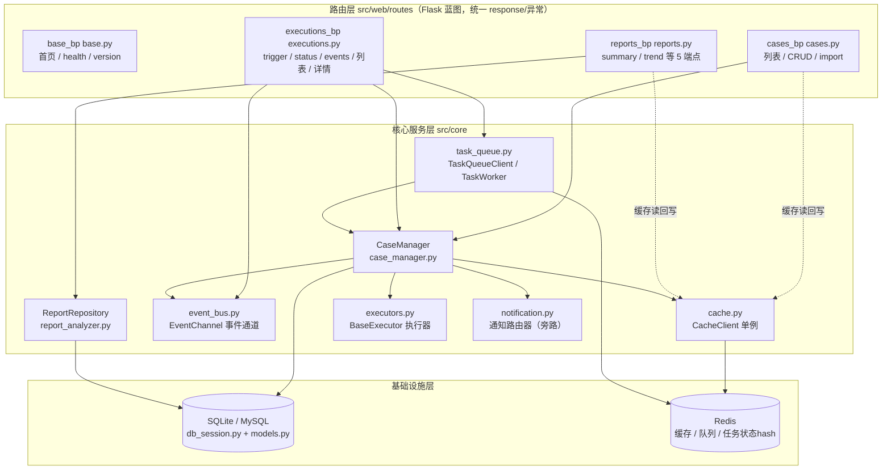
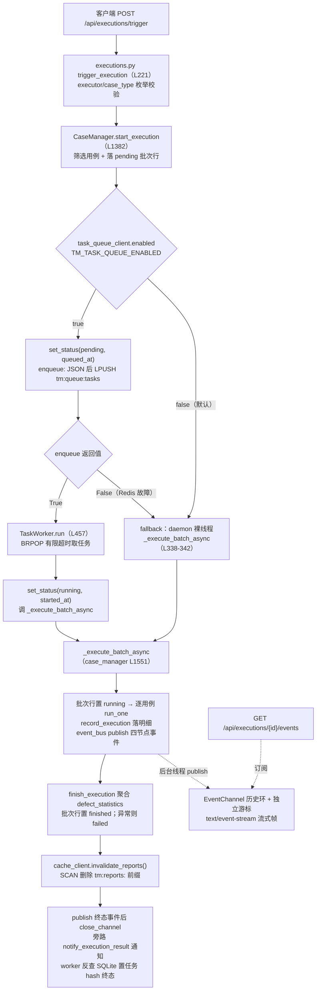
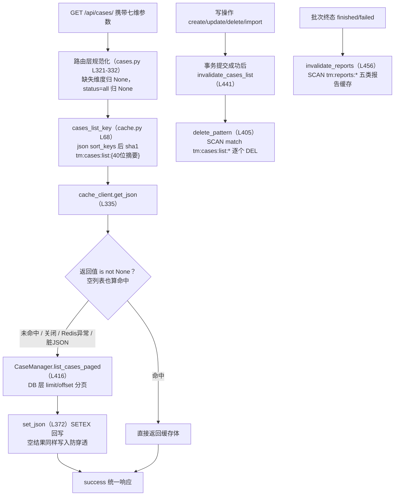
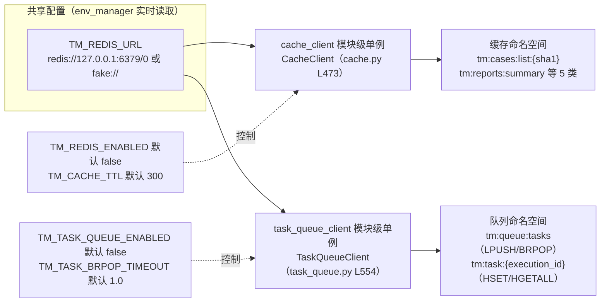

# Web 后端 + Redis 阶段模块架构文档

> 覆盖范围：Day17-Day34（Web 应用工厂、19 个 HTTP 接口、SSE 实时推送、
> Redis 缓存层、Redis 任务队列、缓存量化基准）。
> 本文所有类名、方法名、配置项、行号均与当前代码逐行核对，
> 如后续代码演进，请以源码为准同步修订。

---

## 1. 模块概述

本阶段把 Day1-Day16 的核心域能力（用例管理、批次执行、报告统计、
通知路由）通过 Flask Web 平台对外提供，并引入 Redis 承担两类
旁路基础设施：读加速缓存与异步任务队列。

### 1.1 核心能力清单

| 能力 | 交付日 | 入口 |
| --- | --- | --- |
| Flask 应用工厂 + 多环境配置 | Day17 | `src/web/app.py` `create_app` |
| 统一响应与全局异常体系 | Day18 | `src/web/response.py`、`exceptions.py` |
| 用例列表/CRUD/批量导入（6 端点） | Day19-21 | `src/web/routes/cases.py` |
| 执行批次查询/触发/状态（5 端点） | Day22、Day24 | `src/web/routes/executions.py` |
| 报告统计与质量度量（5 端点） | Day23 | `src/web/routes/reports.py` |
| SSE 实时事件流（多订阅+断线回放+心跳） | Day25-26 | `event_bus.py` + `/events` |
| 执行完成自动邮件/企微通知 | Day27 | `_execute_batch_async` 旁路 |
| 请求日志配对与安全头 | Day29 | `app.py` 请求钩子 |
| Redis 缓存层（默认关闭、静默降级） | Day31 | `src/core/cache.py` |
| Redis 任务队列（生产者-消费者） | Day32 | `src/core/task_queue.py` |
| 真实 Redis 缓存量化基准 | Day33 | `scripts/benchmark_cache.py` |

### 1.2 分层职责一句话

- **路由层**：只做 HTTP 边界的事——参数解析与校验、统一响应封装、
  核心层异常到 HTTP 状态码的翻译，不写业务逻辑。
- **核心服务层**：`CaseManager` 编排执行域、`ReportRepository`
  收敛统计聚合、`event_bus` 进程内发布订阅、`cache`/`task_queue`
  封装 Redis、`notification` 旁路通知。
- **基础设施层**：SQLAlchemy 双模式数据库（开发 SQLite/生产 MySQL）
  与 Redis（缓存 + 队列 + 任务状态 hash）。

---

## 2. 整体架构图

应用工厂装配顺序（[app.py](file:///d:/projects/TestMatrix/src/web/app.py)
`create_app`，L44-98）：建 Flask 实例 → `get_config` 加载 dev/test/
prod 配置 → 注册 4 个蓝图 → `register_error_handlers` 注册全局异常
处理器 → `_register_request_hooks` 注册请求/响应钩子 → `start_worker()`
按队列开关启动消费线程并 `atexit.register(stop_worker)` 兜底。

---

## 3. 关键数据流

### 3.1 触发执行全链路（队列 / 裸线程双通道）

要点：

1. **pending 批次行必须先落 SQLite**（`test_execution_batches`
   表），队列只做调度通道，权威状态永远在数据库。
2. **payload 严格对齐执行体签名**：`{execution_id, cases,
   executor_kind}`，`cases` 是 `start_execution` 已筛好的纯 dict
   列表（executions.py L320-324），worker 不再重复筛选、不重复
   落批次行。
3. **两种调度模式响应逐字段一致**：202 + `data` 三字段
   （execution_id/status/total_cases），客户端无感知。
4. **执行编排零改动复用**：明细落库、SSE 埋点、通知旁路、缓存
   失效全部在 `_execute_batch_async` 内部，Day32 只换了调用方。

### 3.2 缓存读写数据流

要点：

- 命中判定只能用 `is not None`：空列表/空字典是合法缓存值
  （防穿透），用真值判断会把 `[]` 误当未命中。
- 失效时机选在**写库成功之后**：先更新库后删缓存，无锁方案下
  一致性最好；删失败最坏读到旧值直至 TTL（默认 300 秒）。
- 失效只有两个前缀入口，业务代码不直接操作 Redis 命令。

### 3.3 队列与缓存的关系（共享 URL、独立单例、命名空间隔离）

两者是**两个独立单例、两套开关**，仅共享连接 URL 与后端构建
模式（懒连接、`fake://` 内存替身、`decode_responses=True`、
`socket_timeout=2`、`reset_backend()` 测试复位）。key 前缀互不
相交，缓存失效的 SCAN 不会误删队列消息；任一方关闭或故障不
影响另一方。

---

## 4. API 端点清单（19 端点）

完整参数表、curl 示例与 JSON 响应样例见
[API.md](file:///d:/projects/TestMatrix/docs/API.md)，此处仅给分组总览。

| 蓝图 | 方法 | 路径 | 说明 |
| --- | --- | --- | --- |
| base（3） | GET | `/` | 平台首页与版本 |
| base | GET | `/health` | 健康检查，DB 探测 3 秒超时降级 503 |
| base | GET | `/api/version` | 版本信息 |
| cases（6） | GET | `/api/cases/` | 七维筛选分页列表 |
| cases | POST | `/api/cases/` | 创建用例（marshmallow 校验，重复 409） |
| cases | GET | `/api/cases/{case_id}` | 用例详情（不存在 404） |
| cases | PUT | `/api/cases/{case_id}` | 局部更新（case_id 不可改） |
| cases | DELETE | `/api/cases/{case_id}` | 物理删除（204 无响应体） |
| cases | POST | `/api/cases/import` | YAML/Excel 上传幂等 upsert |
| executions（5） | GET | `/api/executions/` | 已完成批次分页列表 |
| executions | GET | `/api/executions/{execution_id}` | 批次汇总 + 明细详情 |
| executions | POST | `/api/executions/trigger` | 触发异步执行（202 + pending） |
| executions | GET | `/api/executions/{id}/status` | 批次状态机查询 |
| executions | GET | `/api/executions/{id}/events` | SSE 实时事件流 |
| reports（5） | GET | `/api/reports/summary` | 全局加权汇总 |
| reports | GET | `/api/reports/trend` | 通过率趋势（limit 1-100） |
| reports | GET | `/api/reports/module-distribution` | 模块分布（悬空归 unknown） |
| reports | GET | `/api/reports/failed-top` | 失败用例 Top 榜 |
| reports | GET | `/api/reports/quality-metrics` | 质量度量三指标 |

通用约定：响应体统一为 `{"code", "message", "data"}`
（[response.py](file:///d:/projects/TestMatrix/src/web/response.py)）；
业务异常经 `APIError` 五子类（404/400/401/403/409）抛出，由
[exceptions.py](file:///d:/projects/TestMatrix/src/web/exceptions.py)
L121 的 `register_error_handlers` 统一兜底，TESTING 模式保留异常
原文、生产模式只回"服务器内部错误"。

---

## 5. Redis 基础设施

### 5.1 缓存层设计要点（src/core/cache.py）

1. **默认关闭、懒连接、灰度零侵入**：`TM_REDIS_ENABLED` 默认
   `false`（`enabled` 属性 L211-222），关闭时 `_get_backend()`
   恒返回 None，get/set/失效全部 no-op；真实后端首条命令才建连，
   应用启动从不强制 Redis 可达。
2. **fake:// 测试协议**：URL 以 `fake://` 开头构建
   `fakeredis.FakeRedis(decode_responses=True)`（L283-297），
   全套测试零真实 Redis 依赖；`reset_backend()`（L308）供
   function 级 fixture 丢弃实例隔离数据。
3. **TTL 兜底**：`TM_CACHE_TTL` 默认 300 秒，`set_json` 用
   SETEX 原子写入；TTL 只兜底主动失效的遗漏，不是主要一致性手段。
4. **SCAN 禁用 KEYS**：`delete_pattern`（L405）用
   `scan_iter(match=前缀*)` 游标迭代逐个 DEL，避免大库 KEYS
   阻塞 Redis 主循环。
5. **空结果防穿透**：空列表、空聚合字典照常 SETEX；命中判定
   用 `is not None`。
6. **静默降级铁律**：get/set/delete_pattern 全部 try/except
   `redis.RedisError` 只打 warning——get 异常按未命中回源，
   set/失效异常跳过，Redis 故障不允许冒泡成 API 500；脏 JSON
   反序列化失败同样按 miss 处理。
7. **七维参数哈希 key**：`cases_list_key`（L68）把规范化参数
   `json.dumps(sort_keys=True, separators=(",", ":"))` 后 sha1，
   参数顺序不影响 key、key 长度固定且不泄露查询内容。

### 5.2 任务队列设计要点（src/core/task_queue.py）

1. **默认关闭 + enqueue 失败必 fallback**：
   `TM_TASK_QUEUE_ENABLED` 默认 false；启用时 `enqueue`（L270）
   捕获 `redis.RedisError/TypeError/ValueError` 返回 False，
   路由据此起裸线程兜底，任务不丢、接口不 500。
2. **单 worker 串行**：`TaskWorker.run`（L457）一个 daemon
   线程循环消费，匹配 SQLite 单文件写锁与个人项目规模；坏任务
   异常被捕获（L508），worker 绝不因单任务异常退出循环。
3. **BRPOP 有限超时**：`TM_TASK_BRPOP_TIMEOUT` 默认 1.0 秒，
   超时返回 None 后循环复查 `stop_event`，禁止永久阻塞；
   `stop_worker`（L604）set 事件 + join 3 秒，幂等且可重启。
4. **任务状态 Redis hash 只是调度层镜像**：
   `tm:task:{execution_id}`（`task_status_key` L68）记录
   pending/queued_at → running/started_at → finished|failed/
   finished_at/error，供队列视角快查；权威状态仍以 SQLite
   批次表为准，worker 收尾反查 `get_execution_status` 决定
   终态（L520-534），不靠"没抛异常=成功"猜测。HSET mapping
   写入（不用已弃用的 HMSET），None 字段剔除。
5. **worker 独立开关**：`TM_TASK_WORKER_ENABLED` 缺省跟随队列
   开关，可单独关闭（只入队不消费的积压测试场景）。
6. **启停挂应用工厂**：`create_app` 末尾 `start_worker()` +
   `atexit.register(stop_worker)`，默认关闭时返回 None 零开销。

### 5.3 key 命名空间隔离表

| 命名空间 | key 形态 | 数据结构 | 归属 |
| --- | --- | --- | --- |
| 用例列表缓存 | `tm:cases:list:{sha1}` | String(JSON)+TTL | cache_client |
| 报告缓存 | `tm:reports:summary` | String(JSON)+TTL | cache_client |
| 报告缓存 | `tm:reports:trend:{limit}` | String(JSON)+TTL | cache_client |
| 报告缓存 | `tm:reports:module_distribution` | String(JSON)+TTL | cache_client |
| 报告缓存 | `tm:reports:failed_top:{limit}` | String(JSON)+TTL | cache_client |
| 报告缓存 | `tm:reports:quality_metrics` | String(JSON)+TTL | cache_client |
| 任务队列 | `tm:queue:tasks`（默认） | List，LPUSH/BRPOP | task_queue_client |
| 任务状态 | `tm:task:{execution_id}` | Hash，HSET/HGETALL | task_queue_client |

### 5.4 量化收益（真实 Redis 实测）

数据来自 [benchmark_cache_report.md](file:///d:/projects/TestMatrix/docs/benchmark_cache_report.md)
（真实 Redis 5.0.14.1，1000 用例 + 100 批次造量，预热 10 次 +
正式 200 次）：

- 用例列表：平均延迟 3.085ms → 1.359ms（降 55.9%），QPS
  324.13 → 735.91（+127.0%）。
- 报告 summary：平均延迟降 58.4%，QPS +140.4%。
- Dashboard 五接口轮询：P95 14.552ms → 1.801ms（降 87.6%），
  QPS 147.56 → 860.04（+482.8%）。
- 10 线程并发列表：QPS 257.87 → 522.56（+102.6%）。
- 正确性三项全过：空结果防穿透、写后主动失效、TTL 到期兜底。

---

## 6. SSE 实时推送

### 6.1 发布订阅模型（src/core/event_bus.py）

- `ExecutionEvent`（L90）：传输单元，四字段
  event_type/data/timestamp/event_id。
- `EventChannel`（L121）：一个批次一条通道。内部是
  `deque(maxlen=1000)` **有界历史环**（非消费式，只追加不弹出）
  + `threading.Condition`；publish 在锁内分配通道级单调递增
  event_id（从 1 起）并 notify_all，各订阅者维护独立游标，
  多标签页并发订阅互不分流。
- 全局注册表 `_CHANNELS`（L360）由 RLock 保护：
  `get_channel(create=False)` 不存在返回 None，
  `close_channel` 先摘注册表再标记 closed（drain 语义：持有旧
  引用的订阅者仍能读完残余事件），`reset_channels` 仅供测试。

### 6.2 通道生命周期

建通道：`_execute_batch_async` 首次埋点时 `get_channel(create=True)`
惰性创建；终态后 `_close_execution_channel` 关闭移除。**事件发布
绝不影响真实执行**：channel 与 CaseManager 两侧各有 try/except
双保险，非法事件类型与迟到事件只丢弃记日志。

### 6.3 /events 流式响应（executions.py L507）

响应 `mimetype="text/event-stream"`，帧格式
`event: 类型\nid: 序号\ndata: JSON\n\n`（`ensure_ascii=False`），
四条分支收敛、全部有限帧后关闭流，不挂死：

1. 批次不存在：404。
2. 通道不在注册表（pending 极早期/CLI 批次/终态已清理）：
   finished 从 DB 汇总+明细**重建完整序列**（合成 id 从 1 起，
   按 Last-Event-ID 过滤）；failed/pending 单帧快照直发。
3. 通道存在但已终态（publish 后 close 前竞态窗口）：
   `snapshot()` 补发积压，缺终态帧时补一条。
4. 运行中：`subscribe(last_event_id, tick=True)` 实时转发，
   收到 batch_finished/batch_failed 断流；0.5 秒等待节拍 +
   15 秒（`HEARTBEAT_INTERVAL_SECONDS`）空闲发 `": heartbeat"`
   注释帧保活，注释帧不推进 Last-Event-ID 游标。

### 6.4 worker 线程 publish 与请求线程订阅的线程安全

- 历史环追加、event_id 分配、游标推进、closed 标记全部在
  Condition 锁内；`subscribe` 的 yield 严格在锁外，消费方慢不
  阻塞生产方。
- 跨线程只传纯 dict（cases 是 `_to_dict` 结果，无 ORM 对象），
  执行线程内全部 DB 操作走独立 `session_scope()`，不借请求
  线程 Session。
- 事件类型四枚举（batch_start/case_finished/batch_finished/
  batch_failed）是埋点方与消费方共用的单一事实来源
  （`VALID_EVENT_TYPES` L72）。

---

## 7. 设计决策与权衡

### 7.1 为什么缓存默认关闭

接入时已有 360 条测试与既定直连 DB 行为，默认关闭保证灰度
零行为漂移（开关一切即回退），且开发机/CI 不必安装 Redis；
收益由 Day33 真实基准量化后，再由部署方按环境显式开启。
备选方案一是"默认开启、不可用再降级"，省一个开关但把 Redis
变成了启动依赖，测试与新环境克隆成本上升；备选二是"假缓存
（进程内 dict）"，零依赖但多实例部署立刻出现不一致，不如不做。

### 7.2 为什么队列用单 worker

当前数据库是 SQLite 单文件、写锁串行，多 worker 并发消费只会
把锁竞争从应用层推给数据库，且模拟执行单批秒级完成，串行吞吐
足够；单 worker 还天然保证同批次明细写入顺序。备选是多 worker
+ 连接池（留给 MySQL 阶段，扩展点见第 8 章），或直接上 Celery，
对当前规模属于过度引入 broker 与运维成本。

### 7.3 为什么失效用 SCAN 不用 KEYS

KEYS 是 O(n) 全量扫描且阻塞 Redis 单线程事件循环，大库上一次
失效可能卡住所有在线命令；SCAN 游标分批、非阻塞，弱一致视图
对"删除迭代开始前已存在的匹配 key"完全够用，迭代期间新增 key
由 TTL 兜底。代价是 SCAN 可能重复返回（实现里 DEL 幂等，无
副作用）与删除非原子，在缓存失效场景均可接受。

### 7.4 为什么 trigger 是 202 而不是同步等待

批次执行是秒级到分钟级任务，同步占住 HTTP 连接会被代理超时
切断、也无法支撑并发批次；202 + pending 批次行表达"已受理"，
结果获取给两条通道：`/status` 轮询（简单、穿透网关友好）与
`/events` SSE（实时、省轮询）。备选 WebSocket 双向能力更强，
但执行场景只有服务端单向推送，SSE 基于原生 HTTP、自动重连、
EventSource 原生支持，成本低一个量级；长轮询则每次都重建请求
且仍有空转开销。

### 7.5 为什么队列与缓存共享 URL 却是两个独立单例

部署上就是同一个 Redis 实例，共享 URL 避免重复配置；但两者
**生命周期、开关策略、故障影响面完全不同**——缓存可整体 no-op
而队列要触发裸线程 fallback，若合成一个"Redis 大管家"单例，
任一侧的开关/异常语义都会污染另一侧。独立单例 + key 前缀隔离
（`tm:cases:*`/`tm:reports:*`/`tm:queue:*`/`tm:task:*`）让
两侧可独立灰度、独立测试（各自 reset_backend）。备选是逻辑库
隔离（select 不同 db），隔离更强但浪费连接且 fakeredis 测试
构造更繁琐，当前前缀隔离已足够。

### 7.6 为什么任务状态用 Redis hash 还要落 SQLite 批次表

Redis hash 提供队列视角的 O(1) 快查（queued_at/started_at/
finished_at/error），但进程重启、Redis 淘汰或丢失不应影响业务
事实；批次状态机、冗余计数、执行明细以 `test_execution_batches`
等表为唯一权威来源，worker 终态反查 DB 决定写 finished 还是
failed。备选是只信 Redis（快但重启丢状态）或只查 DB（准但
每次状态轮询都打关系库），双层方案各取所长。

---

## 8. 扩展点

| 扩展方向 | 当前约束 | 演进路径 |
| --- | --- | --- |
| 多 worker 并发 | SQLite 写锁 + 单消费者 | 迁 MySQL 后按 execution_id 哈希分片，BRPOP 改多队列或 Redis Stream 消费组 |
| 缓存预热 | 首请求回源 | 应用启动后/定时任务对热点 key（summary、首屏五接口）主动回源写缓存 |
| 队列优先级 | 单 List 严格 FIFO | 多 List（tm:queue:tasks:p0/p1）+ BLPOP 按序取，或 Redis Stream |
| 死信队列 | 坏消息仅记日志丢弃 | 超过重试上限的 payload LPUSH 到 tm:queue:dead，配告警与人工重放 |
| SSE 能力升级 | 服务端单向、单进程内存通道 | 需跨进程广播时换 Redis Pub/Sub（保持 get_channel/publish/subscribe 签名）；双向交互再评估 WebSocket |

### 已知问题（缓冲日通读记录，不在本次修改范围）

- 无阻断性缺陷。通读范围内的异常路径（非法分页、非法 limit、
  不存在批次、Redis 故障、坏消息、通道竞态）均有对应兜底，
  并已由本阶段测试与 Day34 补测覆盖。
- 既有技术债（设计上已知、文档已声明）：event_bus 为单进程
  内存过渡方案，跨进程部署需换 Redis Pub/Sub；单 worker 串行
  是 SQLite 阶段有意选择；批次级异常粒度为"一条失败整批
  failed"，单用例隔离留待真实 pytest 执行器接入时细化。

---

## 附录：自讲复盘提纲（关键词与数字锚点）

> 用法：只看关键词，不看代码，口头把每个点讲 3-5 分钟。

1. **应用工厂与蓝图**：create_app L44 → 配置三环境 TM_ENV →
   4 蓝图注册 → 异常处理器 → 请求/响应钩子配对（perf_counter/
   g.request_start）→ start_worker+atexit；统一响应 code/message/
   data；TESTING 双模式错误信息。
2. **SSE**：为何不选 WebSocket（单向推送/原生 HTTP/自动重连）
   → EventChannel 历史环 deque(maxlen=1000) 非消费式 → 锁内
   event_id 单调 → 独立游标多订阅者 → Last-Event-ID 断点回放
   → 15s 心跳注释帧 → 四分支收敛（404/DB重建/竞态 snapshot/
   实时订阅）→ publish 双保险不影响执行。
3. **缓存层**：默认关闭 → 懒连接 → fake:// 测试协议 →
   七维参数 sha1 key → get 命中 is not None（空结果防穿透）
   → SETEX TTL 300s 兜底 → 写后失效、SCAN 禁 KEYS →
   RedisError 静默降级不 500 → 基准 QPS +127%、五接口 +482.8%。
4. **任务队列**：裸线程三痛点（无上限/重启丢/无重试）→
   LPUSH+BRPOP FIFO → payload 对齐真实签名
   {execution_id,cases,executor_kind} → enqueue 失败 fallback
   任务不丢 → 单 worker 串行匹配 SQLite 写锁 → BRPOP 1s 超时
   响应 stop_event → 任务 hash 是镜像、权威在 SQLite →
   执行体/SSE/通知/缓存/202 响应零改动。
5. **202 异步受理**：同步等待会被代理切断 → pending 批次行
   先行落库 → status 轮询与 SSE 双通道取结果 → trigger 固定
   web 服务端裁定 → executor/case_type 枚举校验 400。
